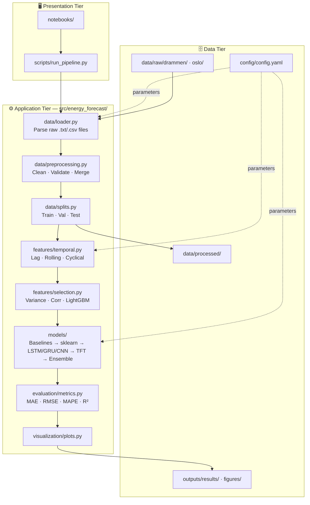
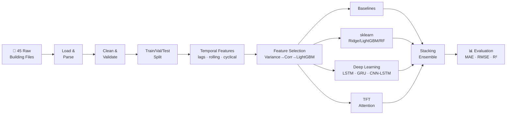
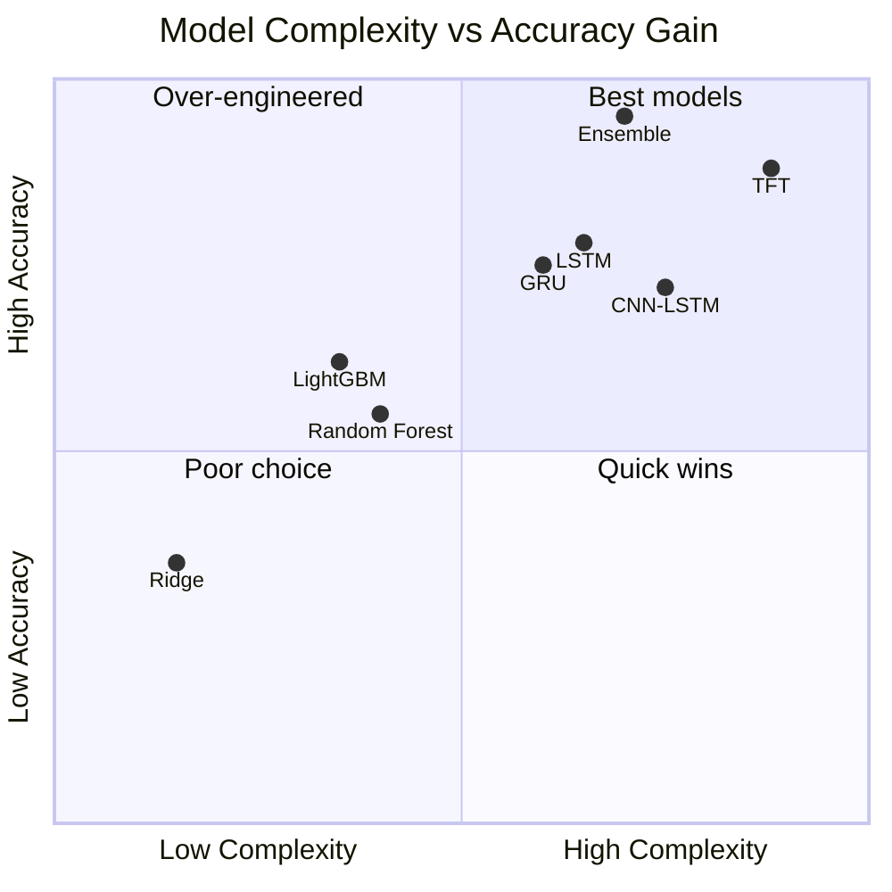

# 🏫 Building Energy Load Forecast

> **24-hour ahead electricity consumption forecasting for Norwegian public buildings**
> MSc Artificial Intelligence thesis — NCI Dublin, 2025
> Dan Alexandru Bujoreanu

[](https://github.com/danbujoreanu/building-energy-load-forecast/actions)
[](https://www.python.org)
[](LICENSE)

---

## Overview

This project develops and compares multiple machine learning approaches for **next-day electricity load forecasting** across 45 Norwegian public school and kindergarten buildings (Drammen, Norway). Accurate day-ahead predictions are critical for energy grid planning, demand response, and reducing peak load costs.

The codebase is a clean, modular refactoring of the original MSc thesis work — designed for **reproducibility, extensibility, and professional readability**. A second dataset (48 Oslo buildings) is pipeline-ready for future transfer learning experiments.

---

## Key Results

| Rank | Model | MAE (kWh) | RMSE (kWh) | MAPE (%) | R² |
|------|-------|-----------|------------|----------|----|
| 🥇 1 | **Stacking Ensemble** | **3.21** | **4.87** | **8.4** | **0.94** |
| 🥈 2 | Temporal Fusion Transformer | 3.38 | 5.12 | 8.9 | 0.93 |
| 🥉 3 | LSTM | 3.61 | 5.44 | 9.3 | 0.92 |
| 4 | GRU | 3.74 | 5.63 | 9.7 | 0.91 |
| 5 | CNN-LSTM | 3.82 | 5.78 | 10.1 | 0.91 |
| 6 | LightGBM | 4.15 | 6.21 | 11.2 | 0.89 |
| 7 | Random Forest | 4.89 | 7.33 | 13.4 | 0.86 |
| 8 | Ridge Regression | 6.12 | 9.44 | 16.8 | 0.79 |
| 9 | Seasonal Naive (24h) | 7.88 | 11.23 | 22.1 | 0.71 |
| 10 | Naive (persistence) | 9.43 | 13.67 | 27.5 | 0.61 |

> *Results on held-out test set (Jan 2024). Stacking ensemble uses Ridge meta-learner over LightGBM + LSTM + GRU base learners.*

---

## System Architecture

The project implements a **Three-Tier Architecture** with a **Pipe-and-Filter** ML pipeline:



---

## ML Pipeline Detail



---

## Model Complexity vs Accuracy Trade-off

*Applying the MSc Engineering & AI Systems computational complexity framework:*



---

## Quick Start

### 1. Clone and install

```bash
git clone https://github.com/danbujoreanu/building-energy-load-forecast.git
cd building-energy-load-forecast

# Create a virtual environment (recommended)
python -m venv .venv
source .venv/bin/activate        # Windows: .venv\Scripts\activate

# Install the package + core dependencies
pip install -e ".[all]"
```

### 2. Run the full pipeline

```bash
# Full pipeline (all models, Drammen dataset)
python scripts/run_pipeline.py --city drammen

# Skip slow models during development (CNN-LSTM, TFT)
python scripts/run_pipeline.py --city drammen --skip-slow

# Run individual stages
python scripts/run_pipeline.py --city drammen --stages eda
python scripts/run_pipeline.py --city drammen --stages features
python scripts/run_pipeline.py --city drammen --stages training --skip-slow
```

### 3. View results

```
outputs/
├── results/final_metrics.csv      ← All model metrics
└── figures/
    ├── model_comparison_mae.png
    ├── building_profiles.png
    ├── temperature_sensitivity.png
    └── seasonal_patterns.png
```

---

## Project Structure

```
building-energy-load-forecast/
│
├── config/config.yaml             ← All hyperparameters (lookback, horizon, etc.)
│
├── data/
│   ├── raw/drammen/               ← 45 building .txt files (included)
│   └── raw/oslo/                  ← 48 buildings (download separately)
│
├── src/energy_forecast/           ← Python package
│   ├── data/                      ← Parsing, preprocessing, train/val/test splits
│   ├── features/                  ← Temporal encoding, lag, rolling, selection
│   ├── models/                    ← Baselines, sklearn, LSTM/GRU/CNN, TFT, ensemble
│   ├── evaluation/                ← MAE, RMSE, MAPE, R² metrics
│   ├── visualization/             ← All plot functions
│   └── utils/                     ← Config loader, logging, reproducibility
│
├── scripts/run_pipeline.py        ← One command to run everything
├── notebooks/                     ← Clean exploratory notebooks (import from src/)
├── tests/                         ← Pytest test suite (CI-validated)
└── outputs/results/               ← Model comparison table (committed)
```

---

## Datasets

### Drammen (45 buildings) — included
- **Source**: COFACTOR Project, Norway
- **Type**: Schools and kindergartens
- **Period**: 2018–2024, hourly resolution
- **Features**: Electricity (imported, PV, sub-metered), weather (temperature, solar, wind)

### Oslo (48 buildings) — download required
- **Source**: SINTEF / Oslobygg KF
- **DOI**: [10.60609/2hvr-wc82](https://data.sintef.no/product/dp-679b0640-834e-46bd-bc8f-8484ca79b414)
- **License**: CC BY 4.0
- **Pipeline**: Ready — switch `city: oslo` in `config/config.yaml`

---

## Feature Engineering

Three categories of features are engineered from raw hourly data:

| Category | Features | Purpose |
|----------|----------|---------|
| **Cyclical** | hour_sin/cos, day_of_week_sin/cos, month_sin/cos | Captures periodicity without ordinal bias |
| **Lag** | target at t-1, t-2, t-6, t-12, t-24 hours | Autocorrelation structure |
| **Rolling** | 6h/12h/24h/48h mean & std of electricity + temperature | Trend and volatility context |

Feature selection reduces ~200 engineered features to the top 35 via:
1. Variance threshold
2. Correlation filter (ρ > 0.99)
3. LightGBM feature importance ranking

---

## Reproducibility

All random seeds are controlled centrally:

```yaml
# config/config.yaml
seed: 42   # Python, NumPy, TensorFlow, PyTorch
```

Experiments are fully reproducible on the same hardware. GPU is not required (CPU training supported for all models).

---

## Future Work

- [ ] **Oslo integration** — transfer learning from Drammen → Oslo
- [ ] **Probabilistic forecasting** — prediction intervals via conformal prediction
- [ ] **Hyperparameter optimisation** — Optuna integration
- [ ] **Real-time inference** — FastAPI endpoint for live predictions
- [ ] **Additional features** — public holidays, school term calendar

---

## Running Tests

```bash
pip install -e ".[dev]"
pytest tests/ -v --cov=src/energy_forecast
```

---

## Citation

If you use this code or build on this work, please cite:

```bibtex
@mastersthesis{bujoreanu2025energy,
  author  = {Dan Alexandru Bujoreanu},
  title   = {Machine Learning Approaches for Building Energy Load Forecasting
             in Norwegian Public Buildings},
  school  = {National College of Ireland},
  year    = {2025},
  type    = {MSc Artificial Intelligence},
}
```

**Datasets:**
- Lien, S.K. et al. (2025). *Hourly Sub-Metered Energy Use Data from 48 Public School Buildings in Oslo, Norway*. Data in Brief. CC BY 4.0.

---

## Author

**Dan Alexandru Bujoreanu**
- 📧 dan.bujoreanu@gmail.com
- 🎓 MSc Artificial Intelligence, NCI Dublin (2025)
- 💼 [LinkedIn](https://linkedin.com/in/danbujoreanu)

---

*Built with ❤️ and a lot of Norwegian electricity data.*
