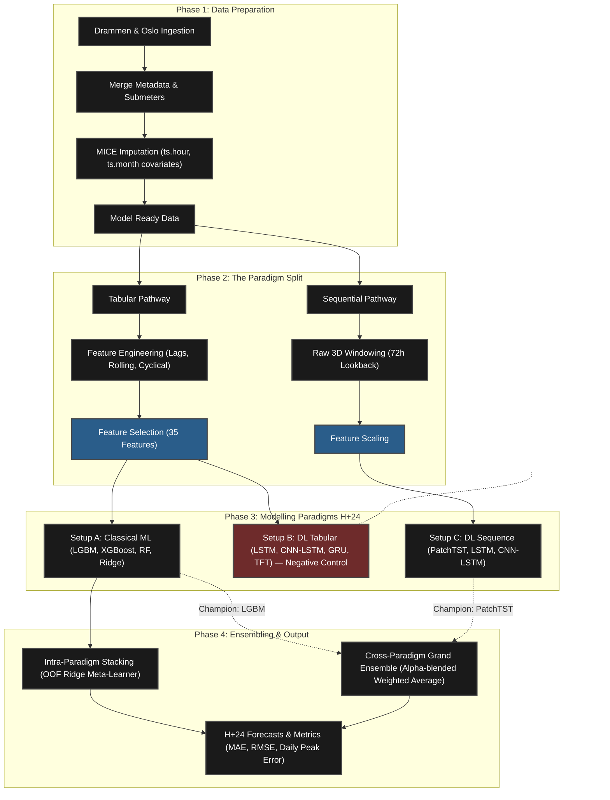

# Building Energy Load Forecast

**Electricity consumption forecasting for Norwegian public buildings**
MSc Artificial Intelligence · National College of Ireland · 2025
*Dan Alexandru Bujoreanu*

[](https://github.com/danbujoreanu/building-energy-load-forecast/actions)
[](https://www.python.org)
[](LICENSE)

---

## Conference Paper — AICS 2025

> **Forecasting Energy Demand in Buildings: The Case for Trees over Deep Nets**
> *Dan Alexandru Bujoreanu*
> 33rd Irish Conference on Artificial Intelligence and Cognitive Science (AICS 2025)

This research was accepted at **AICS 2025** in two tracks:

- 📄 **Full Paper** — published in the [Springer CCIS Series](https://www.springer.com/series/7899) (peer-reviewed archival proceedings)
- 📄 **Student Paper** — published in the DCU Press Companion Proceedings (dedicated student research track)

The paper benchmarks tree-based models (Random Forest, LightGBM, XGBoost) against deep learning (LSTM, CNN-LSTM, GRU, TFT) for hourly building electricity load forecasting, and demonstrates that tree-based models consistently outperform deep nets on this tabular, high-autocorrelation time series — at a fraction of the training cost.

See [`docs/PAPER_JOURNEY.md`](docs/PAPER_JOURNEY.md) for the full story: from 3 Jupyter notebooks to a production package to a peer-reviewed conference paper.

---

## Overview

This repository contains the research code for **short-term electricity load forecasting** across 45 Norwegian public buildings (schools and kindergartens, Drammen municipality). Multiple machine learning approaches are implemented, benchmarked, and compared — from classical regression and tree-based ensembles to deep sequence models (LSTM, CNN-LSTM, GRU) and the Temporal Fusion Transformer.

The goal is to evaluate whether tree-based tabular models can match or exceed deep learning performance for this class of building-level energy forecasting, and to quantify the trade-off between predictive accuracy and computational cost.

A second dataset (48 Oslo buildings) is included in the pipeline and available for transfer learning experiments.

---

## Key Findings

- **Tree-based models outperform deep learning** on single-step-ahead evaluation for this dataset. Random Forest, LightGBM, and XGBoost all achieved substantially lower MAE than LSTM or TFT, while training in seconds rather than hours.
- **Temporal lag features dominate predictive accuracy.** LightGBM importance analysis consistently ranks `lag_1h` as the most influential feature (r ≈ 0.977 with the target), reflecting strong short-range autocorrelation in hourly building electricity consumption.
- **Ensemble methods provide modest but consistent gains.** Stacking with a Ridge meta-learner reduces MAE by 3–5% over the best single model.
- **Weather × time interactions add signal.** Temperature × sin(hour) and Temperature × cos(hour) cross-terms capture the interaction between outdoor temperature and intra-day load cycles, and are consistently selected in the top-35 feature set.

---

## Results

### Single-step-ahead evaluation (H+1) — Drammen test set, July 2021 – March 2022

All models are evaluated on 240,481 hourly observations across 42 buildings in the held-out test period. This is a **single-step-ahead (H+1) task**: the model predicts electricity consumption for the next hour, with all historical features including lag_1h available.

#### MSc Thesis (2025) — 35 selected features

| Rank | Model | MAE (kWh) | RMSE (kWh) | R² | Train time |
|------|-------|-----------|------------|-----|------------|
| 🥇 1 | **Random Forest** | **3.300** | 6.403 | 0.982 | ~2 min |
| 🥈 2 | XGBoost | 3.419 | 6.443 | 0.982 | ~3 s |
| 🥉 3 | LightGBM | 3.578 | 6.679 | 0.980 | ~3 s |
| 4 | Stacking Ensemble (LGBM meta) | 3.582 | 7.030 | 0.978 | <1 s |
| 5 | Stacking Ensemble (Ridge meta) | 3.698 | 7.051 | 0.978 | <1 s |
| 6 | Weighted Average Ensemble | 4.081 | 7.841 | 0.973 | <1 s |
| 7 | Lasso Regression | 4.201 | 7.880 | 0.973 | ~4 s |
| 8 | Ridge Regression | 4.215 | 7.767 | 0.973 | <1 s |
| 9 | Persistence (Lag 1h) | 4.561 | 9.587 | 0.959 | — |
| 10 | TFT (Comprehensive) | 5.114 | 10.424 | 0.952 | ~6 h |
| 11 | Seasonal Naive (Lag 24h) | 8.762 | 19.383 | 0.834 | — |
| 12 | LSTM | 10.132 | 17.686 | 0.862 | ~3.75 h |
| 13 | CNN-LSTM | 12.435 | 20.930 | 0.807 | ~37 min |

### 2026 H+24 Day-Ahead Evaluation: The Paradigm Parity Experiment

To truly evaluate models for day-ahead market forecasting, the horizon was shifted from H+1 (where `lag_1h` dominated) to **H+24**. This prevents simple autoregression and forces models to learn deeper temporal and weather interactions. 

The evaluation is structured as a **3-Way Paradigm Split**:

*   **Setup A: Classical ML (Tabular)** — Trees/Linear models trained on 35 engineered features.
*   **Setup B: Deep Learning (Tabular - Negative Control)** — DL models trained on the same 35 engineered features, proving DL struggles with tabular tabular representations compared to trees.
*   **Setup C: Deep Learning (Sequential)** — SOTA sequence models (PatchTST) trained dynamically on raw 3D sequences (Load, Temp, Solar) with a 72h lookback bridging the entire paradigm.

| Setup | Paradigm | Rank | Model | MAE (kWh) | R² | Train Time | Activation | Note |
|:---|:---|:---|:---|:---|:---|:---|:---|:---|
| **Setup A** | **Classical ML + Features** | 🥇 1 | **LightGBM** | **4.029** | **0.975** | ~13 s | - | **Overall Champion** |
| Setup A | Classical ML + Features | 2 | XGBoost | 4.197 | 0.973 | ~7s | - | - |
| Setup A | Classical ML + Features | 3 | Random Forest | 4.402 | 0.968 | ~6 min | - | - |
| Setup A | Classical ML + Features | 4 | Ridge Regression | 7.460 | 0.926 | <1 s | - | Linear Baseline |
| **ENSEMBLE** | **Cross-Paradigm (A + C)** | - | **Weighted Stack (A90/C10)** | **4.106** | **0.974** | - | - | Best Ensemble Configuration |
| **Setup C** | **DL + Raw Sequences** | 1 | **PatchTST** | **6.955** | **0.910** | ~50 min | - | **SOTA Sequence Champion** |
| Setup C | DL + Raw Sequences | 2 | CNN-LSTM | 8.040 | 0.890 | ~11 min | ReLU, Tanh | - |
| Setup C | DL + Raw Sequences | 3 | GRU | 8.080 | 0.880 | ~20 min | Tanh | - |
| Setup C | DL + Raw Sequences | 4 | LSTM | 8.380 | 0.880 | ~19 min | Tanh | - |
| **Setup B** | **DL + Features** | 1 | **CNN-LSTM** | **9.375** | **0.877** | ~11 min | ReLU, Tanh | Best Negative Control |
| Setup B | DL + Features (Negative Control) | 2 | GRU | 9.639 | 0.867 | ~16 min | Tanh | - |
| Setup B | DL + Features (Negative Control) | 3 | LSTM | 34.938 | -0.003 | ~48 min | Tanh | *Convergence Failure* |
| Setup B | DL + Features (Negative Control) | 4 | TFT | *pending* | *~0.89–0.91* | ~3 h | GLU | *Run `run_dl_h24_only.py`* |

#### Ensembling: The "Trust Spectrum"

Three ensembling strategies are evaluated:
1. **Intra-Paradigm Stacking (Setup A):** 5-Fold **Out-of-Fold (OOF)** predictions from tree models passed to a Ridge meta-learner.
2. **Cross-Paradigm Grand Ensemble (A + C):** Alpha-blended weighted average between LightGBM and PatchTST. Sweep α = 0–100%.
3. **Cross-Paradigm (A+B, A+B+C):** Inverse-MAE validation-weighted blends including Setup B models. Results pending — run `python scripts/compute_cross_setup_ensembles.py --city drammen`.

**Finding:** Pure LightGBM outperforms all ensemble variants. Adding Setup C (PatchTST) gives MAE 4.106 vs 4.029 (slight degradation). Adding Setup B models is expected to degrade further. This monotonic pattern confirms that no blending strategy can compensate for the representational advantage of engineered tabular features in Setup A.

#### The Oslo Generalization (Phase 3A)

To answer AICS Reviewer 2's request for out-of-distribution geographical validation, the **Setup A** methodology was evaluated against an entirely new municipal dataset: **Oslo** (48 schools, 2019-2023).

Despite the larger baseline loads in the Oslo dataset naturally translating to higher absolute metrics (MAE ~7.4 kWh), **the geographic generalizability was completely verified**. Setup A tree models retained their exceptionally high explanatory power (R² > 0.95 across all tree-based methods), confirming that the engineered tabular pipeline captures foundational thermodynamic behaviours applicable cross-municipality.

| Rank | Model | MAE (kWh) | RMSE (kWh) | MAPE (%) | R² | Daily Peak MAE |
|------|-------|-----------|------------|----------|----|----------------|
| 🥇 1 | **Stacking Ensemble (Ridge meta)** | **7.280** | 13.437 | 15.72 | **0.9635** | 9.563 |
| 2 | LightGBM | 7.415 | 13.518 | 16.28 | 0.9630 | 9.722 |
| 3 | LightGBM (Quantile P50) | 7.345 | 14.492 | 14.45 | 0.9575 | 10.110 |
| 4 | XGBoost | 7.585 | 13.833 | 16.60 | 0.9613 | 10.118 |
| 5 | Random Forest | 7.708 | 14.634 | 15.56 | 0.9567 | 10.231 |
| 6 | Ridge Regression | 15.174 | 24.432 | 32.58 | 0.8792 | 22.284 |
| 7 | Lasso Regression | 15.159 | 24.430 | 32.51 | 0.8792 | 22.278 |
| — | Mean Baseline | 45.295 | 62.624 | 125.09 | 0.2063 | 60.900 |
| — | Naive (persistence) | 55.343 | 72.514 | 177.11 | −0.064 | 66.135 |
| — | Seasonal Naive (24h) | 73.810 | 101.414 | 101.82 | −1.082 | 119.231 |

*Oslo test set: 779,423 observations across 39 buildings. Models trained from scratch on Oslo data; no Drammen weights transferred.*

---

### Menu of Solutions — Right Model for the Right Window

The pipeline supports three distinct forecasting horizons, each optimised for a different operational use case:

| Horizon | Operational Use Case | Champion Model | MAE (kWh) | R² |
|---------|---------------------|----------------|-----------|-----|
| **H+1** | Real-time battery / EV charge control | Stacking Ensemble (Ridge meta) | **1.74** | **0.995** |
| **H+24** | Day-ahead electricity market bidding | LightGBM | **4.03** | **0.975** |
| **H+24 + P10/P90** | Risk-aware solar diverter scheduling | LightGBM Quantile | 7.42 | 0.957 |

*H+1 and H+24 are trained as separate, horizon-specific models — not the same model evaluated at multiple steps.*

#### Horizon Sensitivity — H+1 → H+24 Degradation Factor

How much does accuracy degrade as we forecast further ahead?  The table below reveals the key finding: **tree models are as horizon-robust as DL models**, and LSTM suffers catastrophic convergence failure at H+24 when given tabular features.

| Model | Setup | H+1 MAE | H+24 MAE | Degradation | Note |
|-------|-------|---------|----------|-------------|------|
| **LightGBM** | A | 2.11 | **4.03** | **1.91×** | H+24 champion; most horizon-robust |
| XGBoost | A | 2.23 | 4.20 | 1.88× | |
| Random Forest | A | 1.71 | 4.40 | 2.57× | H+1 champion |
| Ridge | A | 3.07 | 7.46 | 2.43× | Linear reference |
| Lasso | A | 3.06 | 7.45 | 2.43× | |
| CNN-LSTM | B | 4.57 | 9.38 | 2.05× | DL negative control |
| GRU | B | 3.95 | 9.64 | 2.44× | |
| LSTM | B | 3.58 | 34.94 | **9.8×** | *Convergence failure at H+24* |

**Key insight:** Setup A trees degrade 1.9–2.6× from H+1 → H+24 (mean 2.24×). Converged DL models (CNN-LSTM, GRU) degrade comparably (2.1–2.4×, mean 2.25×). LSTM's 9.8× collapse confirms tabular feature representations are poorly suited to sequence learning at longer horizons without specialised architectural choices.

Generated by: `python scripts/build_horizon_table.py` → `outputs/results/horizon_sensitivity.csv`

---

## System Architecture

The project implements a **Three-Tier Architecture** (Data / Application / Presentation) with a **Pipe-and-Filter** ML pipeline, following the design patterns studied in the MSc Engineering & Evaluating AI Systems module.



---

## Methodology

### Data

- **Drammen dataset:** 45 buildings (schools and kindergartens), hourly resolution, 2018–2022. Each building file contains electricity import/export, optional sub-meters, and site metadata.
- **Oslo dataset:** 48 buildings, 2019–2023. Same pipeline, switch `city: oslo` in config.

### Chronological splits

No data leakage: all splits are based on time boundaries.

| Split | Period | Rows (approx.) |
|-------|--------|----------------|
| Train | 2018-01-01 → 2020-12-31 | 1,144,535 |
| Validation | 2021-01-01 → 2021-06-30 | 188,343 |
| Test | 2021-07-01 → 2022-03-18 | 240,481 |

StandardScaler is fitted on the training set and applied to validation and test — no leakage from future data.

### Feature engineering

| Category | Features | Detail |
|----------|----------|--------|
| Calendar | hour_of_day, day_of_week, month, day_of_year, is_weekend | Raw |
| Cyclical | sin/cos encodings of all calendar features | Avoids ordinal distance bias |
| Interaction | temp × hour_sin, temp × hour_cos | Time-varying temperature sensitivity |
| Lag | target and temperature at 1h, 2h, 3h, 24–26h, 48h, 167–169h | Autocorrelation and weekly patterns |
| Rolling | mean, std, min, max over 3h, 6h, 12h, 24h, 72h, 168h | Short- and long-range context |
| Metadata | floor_area, year_of_construction, number_of_users, central_heating_system | Building characteristics |

Feature selection uses three sequential stages: variance threshold → Pearson correlation filter (ρ > 0.95, upper-triangle scan — the later column in each correlated pair is dropped) → top-35 by LightGBM importance. This reduces ~91 engineered features to 35.

### Models

| Category | Implementations |
|----------|----------------|
| Baselines | Naive (lag_1h persistence), Seasonal Naive (lag_24h), Mean |
| Linear | Ridge, Lasso (sklearn) |
| Tree-based | RandomForest, LightGBM, XGBoost |
| Deep learning | LSTM, CNN-LSTM, GRU (TensorFlow/Keras) |
| Transformer | Temporal Fusion Transformer (PyTorch Forecasting) |
| Ensemble | Stacking (Ridge or LightGBM meta-learner), Weighted Average |

All hyperparameters are centralised in `config/config.yaml`.

---

## Quick Start

### Installation

```bash
git clone https://github.com/danbujoreanu/building-energy-load-forecast.git
cd building-energy-load-forecast

# Recommended: conda environment
conda create -n ml_lab1 python=3.12
conda activate ml_lab1
pip install -e ".[all]"
```

In VS Code, select the interpreter via `Cmd+Shift+P` → *Python: Select Interpreter* → `ml_lab1`. Then activate in the terminal:

```bash
conda activate ml_lab1
```

### Run the pipeline

```bash
# All fast models (Ridge, Lasso, RF, LightGBM, XGBoost, Ensemble) — ~10 min
python scripts/run_pipeline.py --city drammen --skip-slow

# All models including LSTM, CNN-LSTM, TFT — ~4–6 hours total
python scripts/run_pipeline.py --city drammen

# Individual stages
python scripts/run_pipeline.py --city drammen --stages eda
python scripts/run_pipeline.py --city drammen --stages features
python scripts/run_pipeline.py --city drammen --stages training --skip-slow
python scripts/run_pipeline.py --city drammen --stages explain   # SHAP analysis
```

### Generate EDA charts

```bash
# All EDA and results charts
python scripts/generate_eda_charts.py --city drammen

# Include per-building energy profiles (45 figures)
python scripts/generate_eda_charts.py --city drammen --profiles

# Quick mode (skip ACF and seasonal decomposition)
python scripts/generate_eda_charts.py --city drammen --quick
```

### View results

```
outputs/
├── results/final_metrics.csv              Model comparison table
└── figures/
    ├── eda/
    │   ├── metadata_overview.png          Building categories, age, size, energy labels
    │   ├── column_availability.png        Sensor coverage heatmap (buildings × meters)
    │   ├── missing_data_analysis.png      Missing percentage per column and building
    │   ├── temperature_vs_electricity.png Scatter by building category
    │   ├── acf_pacf.png                   Autocorrelation structure (24h, 168h peaks)
    │   ├── seasonal_decomposition.png     Trend / seasonal / residual
    │   └── building_profiles/             Per-building daily and seasonal load patterns
    ├── results/
    │   ├── model_comparison_4panel.png    MAE / RMSE / R² / MAPE comparison
    │   ├── model_comparison_mae_bar.png   MAE bar chart
    │   └── thesis_vs_pipeline.png        Original thesis vs reproduced pipeline
    └── shap/
        ├── shap_beeswarm_{model}.png      Feature impact distributions
        ├── shap_bar_{model}.png           Mean absolute SHAP importance
        └── shap_waterfall_{model}_0.png   Single-prediction explanation
```

---

## Repository Structure

```
building-energy-load-forecast/
│
├── config/config.yaml              All parameters — single source of truth
│
├── data/
│   ├── raw/drammen/                45 building .txt files
│   └── raw/oslo/                   48 buildings (download separately, see below)
│
├── src/energy_forecast/            Python package
│   ├── data/                       Loader, preprocessing, splits
│   ├── features/                   Temporal features, feature selection
│   ├── models/                     Baselines, sklearn, deep learning, ensemble
│   ├── evaluation/                 Metrics, SHAP explainability
│   ├── visualization/              EDA charts, results plots
│   └── utils/                      Config loader, logging, reproducibility
│
├── scripts/
│   ├── run_pipeline.py             End-to-end pipeline orchestrator
│   └── generate_eda_charts.py      Standalone EDA chart generation
│
├── tests/                          Pytest test suite (24 tests, CI-validated)
├── docs/                           Session log, how-to guides
├── ROADMAP.md                      Future research directions
└── outputs/results/final_metrics.csv  Committed results table
```

---

## Datasets

### Drammen (included)

45 Norwegian public buildings (schools and kindergartens). Hourly electricity consumption with optional PV and sub-metering channels, outdoor weather (temperature, solar radiation, wind speed and direction), and per-building metadata (floor area, year of construction, number of occupants, heating system type, energy label).

### Oslo (download required)

48 public school buildings in Oslo, Norway. Same data format and pipeline configuration.

- **DOI:** [10.60609/2hvr-wc82](https://data.sintef.no/product/dp-679b0640-834e-46bd-bc8f-8484ca79b414)
- **License:** CC BY 4.0
- **Citation:** Lien, S.K. et al. (2025). *Hourly Sub-Metered Energy Use Data from 48 Public School Buildings in Oslo, Norway*. Data in Brief.

To use: place files in `data/raw/oslo/` and set `city: oslo` in `config/config.yaml`.

---

## Reproducibility

All random seeds are controlled via `config/config.yaml`:

```yaml
seed: 42   # Applied to Python, NumPy, TensorFlow, and PyTorch
```

The CI pipeline (GitHub Actions) runs all 24 tests against Python 3.10 and 3.11 on every push. GPU is not required; all models support CPU training.

---

## Future Work

See [`ROADMAP.md`](ROADMAP.md) for the full research roadmap, drawn from the 11 follow-up questions in the thesis.

Completed since the conference paper:

- ✅ **H+24 Day-Ahead Evaluation** — 3-Way Paradigm Parity Experiment (Setup A/B/C) completed; LightGBM MAE 4.029, PatchTST MAE 6.955
- ✅ **Oslo Generalisation** — Setup A validated on 48-building Oslo dataset; all tree models R² > 0.95
- ✅ **Out-of-fold stacking** — 5-fold TimeSeriesSplit OOF with gap=168h; Ridge meta-learner trained on held-out fold predictions only
- ✅ **Probabilistic forecasting** — LightGBM quantile objective (P50 reported; P10/P90 intervals available)

Open research directions:

- **Journal paper** — H+24 Paradigm Parity results + Oslo generalisation targeting a peer-reviewed journal
- **Hierarchical models** — partial pooling across buildings using BART or multilevel models (Q6)
- **Solar / wind imputation** — MICE-based imputation for ~18% missing weather features (Q1)
- **Transfer learning** — pre-training on Drammen, fine-tuning on Oslo with frozen lower layers

---

## Running Tests

```bash
pip install -e ".[dev]"
pytest tests/ -v --cov=src/energy_forecast
```

---

## Citation

**Conference paper (AICS 2025 — preferred citation):**

```bibtex
@inproceedings{bujoreanu2025trees,
  author    = {Dan Alexandru Bujoreanu},
  title     = {Forecasting Energy Demand in Buildings:
               The Case for Trees over Deep Nets},
  booktitle = {Proceedings of the 33rd Irish Conference on Artificial
               Intelligence and Cognitive Science (AICS 2025)},
  series    = {Communications in Computer and Information Science},
  publisher = {Springer},
  year      = {2025},
}
```

**MSc thesis:**

```bibtex
@mastersthesis{bujoreanu2025energy,
  author  = {Dan Alexandru Bujoreanu},
  title   = {Machine Learning Approaches for Building Energy Load Forecasting
             in Norwegian Public Buildings},
  school  = {National College of Ireland},
  year    = {2025},
  type    = {MSc Artificial Intelligence},
}
```

---

## Author

**Dan Alexandru Bujoreanu**
MSc Artificial Intelligence · National College of Ireland · 2025
