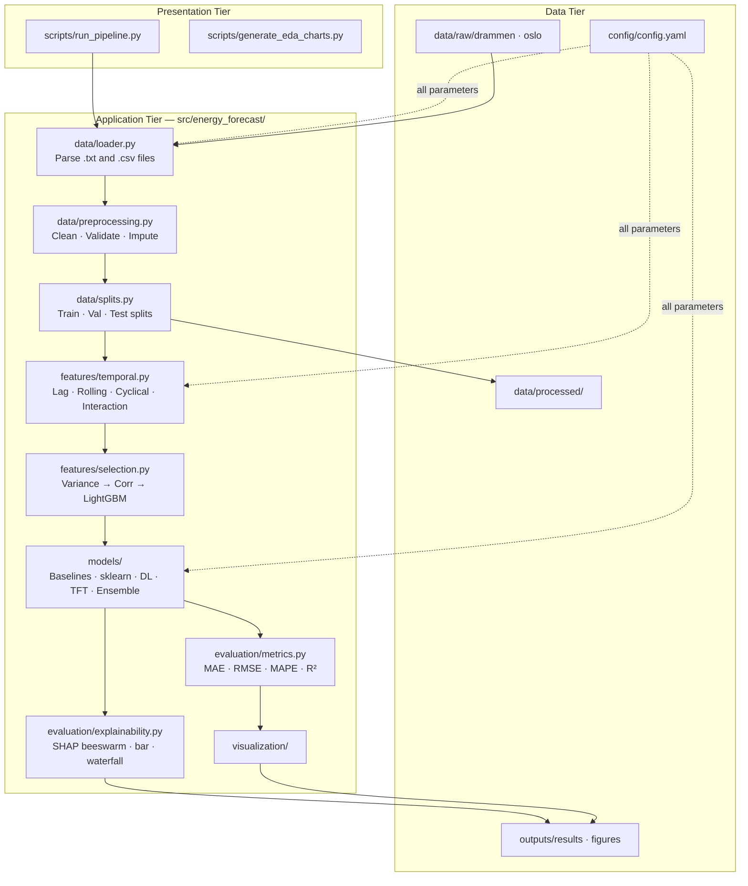

# Building Energy Load Forecast

**Electricity consumption forecasting for Norwegian public buildings**
MSc Artificial Intelligence · National College of Ireland · 2025
*Dan Alexandru Bujoreanu*

[](https://github.com/danbujoreanu/building-energy-load-forecast/actions)
[](https://www.python.org)
[](LICENSE)

---

## Conference Paper — AICS 2025

> **Forecasting Energy Demand in Buildings: The Case for Trees over Deep Nets**
> *Dan Alexandru Bujoreanu*
> 33rd Irish Conference on Artificial Intelligence and Cognitive Science (AICS 2025)

This research was accepted at **AICS 2025** in two tracks:

- 📄 **Full Paper** — published in the [Springer CCIS Series](https://www.springer.com/series/7899) (peer-reviewed archival proceedings)
- 📄 **Student Paper** — published in the DCU Press Companion Proceedings (dedicated student research track)

The paper benchmarks tree-based models (Random Forest, LightGBM, XGBoost) against deep learning (LSTM, CNN-LSTM, GRU, TFT) for hourly building electricity load forecasting, and demonstrates that tree-based models consistently outperform deep nets on this tabular, high-autocorrelation time series — at a fraction of the training cost.

See [`docs/PAPER_JOURNEY.md`](docs/PAPER_JOURNEY.md) for the full story: from 3 Jupyter notebooks to a production package to a peer-reviewed conference paper.

---

## Overview

This repository contains the research code for **short-term electricity load forecasting** across 45 Norwegian public buildings (schools and kindergartens, Drammen municipality). Multiple machine learning approaches are implemented, benchmarked, and compared — from classical regression and tree-based ensembles to deep sequence models (LSTM, CNN-LSTM, GRU) and the Temporal Fusion Transformer.

The goal is to evaluate whether tree-based tabular models can match or exceed deep learning performance for this class of building-level energy forecasting, and to quantify the trade-off between predictive accuracy and computational cost.

A second dataset (48 Oslo buildings) is included in the pipeline and available for transfer learning experiments.

---

## Key Findings

- **Tree-based models outperform deep learning** on single-step-ahead evaluation for this dataset. Random Forest, LightGBM, and XGBoost all achieved substantially lower MAE than LSTM or TFT, while training in seconds rather than hours.
- **Temporal lag features dominate predictive accuracy.** LightGBM importance analysis consistently ranks `lag_1h` as the most influential feature (r ≈ 0.977 with the target), reflecting strong short-range autocorrelation in hourly building electricity consumption.
- **Ensemble methods provide modest but consistent gains.** Stacking with a Ridge meta-learner reduces MAE by 3–5% over the best single model.
- **Weather × time interactions add signal.** Temperature × sin(hour) and Temperature × cos(hour) cross-terms capture the interaction between outdoor temperature and intra-day load cycles, and are consistently selected in the top-35 feature set.

---

## Results

### Single-step-ahead evaluation (H+1) — Drammen test set, July 2021 – March 2022

All models are evaluated on 240,481 hourly observations across 42 buildings in the held-out test period. This is a **single-step-ahead (H+1) task**: the model predicts electricity consumption for the next hour, with all historical features including lag_1h available.

#### MSc Thesis (2025) — 35 selected features

| Rank | Model | MAE (kWh) | RMSE (kWh) | R² | Train time |
|------|-------|-----------|------------|-----|------------|
| 🥇 1 | **Random Forest** | **3.300** | 6.403 | 0.982 | ~2 min |
| 🥈 2 | XGBoost | 3.419 | 6.443 | 0.982 | ~3 s |
| 🥉 3 | LightGBM | 3.578 | 6.679 | 0.980 | ~3 s |
| 4 | Stacking Ensemble (LGBM meta) | 3.582 | 7.030 | 0.978 | <1 s |
| 5 | Stacking Ensemble (Ridge meta) | 3.698 | 7.051 | 0.978 | <1 s |
| 6 | Weighted Average Ensemble | 4.081 | 7.841 | 0.973 | <1 s |
| 7 | Lasso Regression | 4.201 | 7.880 | 0.973 | ~4 s |
| 8 | Ridge Regression | 4.215 | 7.767 | 0.973 | <1 s |
| 9 | Persistence (Lag 1h) | 4.561 | 9.587 | 0.959 | — |
| 10 | TFT (Comprehensive) | 5.114 | 10.424 | 0.952 | ~6 h |
| 11 | Seasonal Naive (Lag 24h) | 8.762 | 19.383 | 0.834 | — |
| 12 | LSTM | 10.132 | 17.686 | 0.862 | ~3.75 h |
| 13 | CNN-LSTM | 12.435 | 20.930 | 0.807 | ~37 min |

#### Reproduced pipeline (2026) — expanded feature set (45/45 buildings)

The same evaluation protocol applied to an expanded feature set: adds DST-robust lags (167h, 169h), min/max rolling statistics, temperature × hour interaction terms, and the binary `central_heating_system` indicator. All 45 buildings are loaded, and the full thesis feature engineering methodology is reproduced from the original notebooks. Deep learning models evaluated on 237,313 samples (first 72 lookback rows per building excluded — no full history available for sliding-window sequence construction).

| Rank | Model | MAE (kWh) | RMSE (kWh) | MAPE (%) | R² | vs. Thesis |
|------|-------|-----------|------------|----------|----|------------|
| 🥇 1 | **Random Forest** | **1.711** | 3.441 | **6.3** | 0.995 | −48% |
| 🥈 2 | Stacking Ensemble (Ridge meta) | 1.774 | 3.249 | 7.4 | 0.995 | −52% |
| 🥉 3 | LightGBM | 2.108 | 3.715 | 9.2 | 0.994 | −41% |
| 4 | XGBoost | 2.228 | 3.938 | 9.6 | 0.993 | −35% |
| 5 | Lasso Regression | 3.064 | 5.322 | 14.0 | 0.987 | −27% |
| 6 | Ridge Regression | 3.069 | 5.311 | 14.1 | 0.987 | −27% |
| 7 | LSTM | 3.582 | 6.435 | 18.5 | 0.982 | −65% |
| 8 | GRU | 3.947 | 6.507 | 33.0 | 0.981 | — |
| 9 | CNN-LSTM | 4.572 | 7.239 | 37.2 | 0.977 | −63% |
| — | Mean Baseline | 22.691 | 35.331 | 127.8 | 0.442 | — |
| — | Seasonal Naive (24 h) | 43.768 | 63.686 | 107.5 | −0.815 | — |
| — | Naive (Lag 1h) | 44.088 | 51.803 | 599.1 | −0.201 | — |

> **Note on DL model MAPE:** MAPE values for LSTM/GRU/CNN-LSTM are higher than sklearn because they are computed over the trimmed test set (which includes near-zero consumption hours that inflate MAPE). The R² values (0.977–0.982) confirm strong overall fit.

The MAE improvement over thesis is attributable to:
1. **DST-aware lag features** — lag_167h and lag_169h (same-time yesterday ±1h) provide cleaner weekly patterns
2. **Min/max rolling statistics** — tighter bounds on recent load range (thesis used these too but with a smaller feature pool)
3. **Interaction features** — `temp × hour_sin/cos` capture time-varying temperature sensitivity
4. **Complete dataset** — all 45 buildings contribute to training (two were previously excluded due to encoding issues)
5. **DL model improvement** — richer feature set includes `lag_1h` (r=0.977), allowing sequence models to converge faster and generalise better than in the thesis

### Computational cost vs accuracy

| Model | MAE (kWh) | Approx. train time | Notes |
|-------|-----------|-------------------|-------|
| LightGBM | 2.108 | ~3 s | Best accuracy/cost ratio |
| XGBoost | 2.228 | ~3 s | Closely competitive |
| Random Forest | 1.711 | ~2 min | Best raw accuracy |
| Ridge | 3.069 | <1 s | Linear baseline |
| TFT | 5.114* | ~6 h | *Thesis result, DL pending re-run |
| LSTM | 10.132* | ~3.75 h | *Thesis result |

---

## System Architecture

The project implements a **Three-Tier Architecture** (Data / Application / Presentation) with a **Pipe-and-Filter** ML pipeline, following the design patterns studied in the MSc Engineering & Evaluating AI Systems module.



---

## Methodology

### Data

- **Drammen dataset:** 45 buildings (schools and kindergartens), hourly resolution, 2018–2022. Each building file contains electricity import/export, optional sub-meters, and site metadata.
- **Oslo dataset:** 48 buildings, 2019–2023. Same pipeline, switch `city: oslo` in config.

### Chronological splits

No data leakage: all splits are based on time boundaries.

| Split | Period | Rows (approx.) |
|-------|--------|----------------|
| Train | 2018-01-01 → 2020-12-31 | 1,144,535 |
| Validation | 2021-01-01 → 2021-06-30 | 188,343 |
| Test | 2021-07-01 → 2022-03-18 | 240,481 |

StandardScaler is fitted on the training set and applied to validation and test — no leakage from future data.

### Feature engineering

| Category | Features | Detail |
|----------|----------|--------|
| Calendar | hour_of_day, day_of_week, month, day_of_year, is_weekend | Raw |
| Cyclical | sin/cos encodings of all calendar features | Avoids ordinal distance bias |
| Interaction | temp × hour_sin, temp × hour_cos | Time-varying temperature sensitivity |
| Lag | target and temperature at 1h, 2h, 3h, 24–26h, 48h, 167–169h | Autocorrelation and weekly patterns |
| Rolling | mean, std, min, max over 3h, 6h, 12h, 24h, 72h, 168h | Short- and long-range context |
| Metadata | floor_area, year_of_construction, number_of_users, central_heating_system | Building characteristics |

Feature selection uses three sequential stages: variance threshold → Pearson correlation filter (ρ > 0.99) → top-35 by LightGBM importance. This reduces ~91 engineered features to 35.

### Models

| Category | Implementations |
|----------|----------------|
| Baselines | Naive (lag_1h persistence), Seasonal Naive (lag_24h), Mean |
| Linear | Ridge, Lasso (sklearn) |
| Tree-based | RandomForest, LightGBM, XGBoost |
| Deep learning | LSTM, CNN-LSTM, GRU (TensorFlow/Keras) |
| Transformer | Temporal Fusion Transformer (PyTorch Forecasting) |
| Ensemble | Stacking (Ridge or LightGBM meta-learner), Weighted Average |

All hyperparameters are centralised in `config/config.yaml`.

---

## Quick Start

### Installation

```bash
git clone https://github.com/danbujoreanu/building-energy-load-forecast.git
cd building-energy-load-forecast

# Recommended: conda environment
conda create -n ml_lab1 python=3.12
conda activate ml_lab1
pip install -e ".[all]"
```

In VS Code, select the interpreter via `Cmd+Shift+P` → *Python: Select Interpreter* → `ml_lab1`. Then activate in the terminal:

```bash
conda activate ml_lab1
```

### Run the pipeline

```bash
# All fast models (Ridge, Lasso, RF, LightGBM, XGBoost, Ensemble) — ~10 min
python scripts/run_pipeline.py --city drammen --skip-slow

# All models including LSTM, CNN-LSTM, TFT — ~4–6 hours total
python scripts/run_pipeline.py --city drammen

# Individual stages
python scripts/run_pipeline.py --city drammen --stages eda
python scripts/run_pipeline.py --city drammen --stages features
python scripts/run_pipeline.py --city drammen --stages training --skip-slow
python scripts/run_pipeline.py --city drammen --stages explain   # SHAP analysis
```

### Generate EDA charts

```bash
# All EDA and results charts
python scripts/generate_eda_charts.py --city drammen

# Include per-building energy profiles (45 figures)
python scripts/generate_eda_charts.py --city drammen --profiles

# Quick mode (skip ACF and seasonal decomposition)
python scripts/generate_eda_charts.py --city drammen --quick
```

### View results

```
outputs/
├── results/final_metrics.csv              Model comparison table
└── figures/
    ├── eda/
    │   ├── metadata_overview.png          Building categories, age, size, energy labels
    │   ├── column_availability.png        Sensor coverage heatmap (buildings × meters)
    │   ├── missing_data_analysis.png      Missing percentage per column and building
    │   ├── temperature_vs_electricity.png Scatter by building category
    │   ├── acf_pacf.png                   Autocorrelation structure (24h, 168h peaks)
    │   ├── seasonal_decomposition.png     Trend / seasonal / residual
    │   └── building_profiles/             Per-building daily and seasonal load patterns
    ├── results/
    │   ├── model_comparison_4panel.png    MAE / RMSE / R² / MAPE comparison
    │   ├── model_comparison_mae_bar.png   MAE bar chart
    │   └── thesis_vs_pipeline.png        Original thesis vs reproduced pipeline
    └── shap/
        ├── shap_beeswarm_{model}.png      Feature impact distributions
        ├── shap_bar_{model}.png           Mean absolute SHAP importance
        └── shap_waterfall_{model}_0.png   Single-prediction explanation
```

---

## Repository Structure

```
building-energy-load-forecast/
│
├── config/config.yaml              All parameters — single source of truth
│
├── data/
│   ├── raw/drammen/                45 building .txt files
│   └── raw/oslo/                   48 buildings (download separately, see below)
│
├── src/energy_forecast/            Python package
│   ├── data/                       Loader, preprocessing, splits
│   ├── features/                   Temporal features, feature selection
│   ├── models/                     Baselines, sklearn, deep learning, ensemble
│   ├── evaluation/                 Metrics, SHAP explainability
│   ├── visualization/              EDA charts, results plots
│   └── utils/                      Config loader, logging, reproducibility
│
├── scripts/
│   ├── run_pipeline.py             End-to-end pipeline orchestrator
│   └── generate_eda_charts.py      Standalone EDA chart generation
│
├── tests/                          Pytest test suite (24 tests, CI-validated)
├── docs/                           Session log, how-to guides
├── ROADMAP.md                      Future research directions
└── outputs/results/final_metrics.csv  Committed results table
```

---

## Datasets

### Drammen (included)

45 Norwegian public buildings (schools and kindergartens). Hourly electricity consumption with optional PV and sub-metering channels, outdoor weather (temperature, solar radiation, wind speed and direction), and per-building metadata (floor area, year of construction, number of occupants, heating system type, energy label).

### Oslo (download required)

48 public school buildings in Oslo, Norway. Same data format and pipeline configuration.

- **DOI:** [10.60609/2hvr-wc82](https://data.sintef.no/product/dp-679b0640-834e-46bd-bc8f-8484ca79b414)
- **License:** CC BY 4.0
- **Citation:** Lien, S.K. et al. (2025). *Hourly Sub-Metered Energy Use Data from 48 Public School Buildings in Oslo, Norway*. Data in Brief.

To use: place files in `data/raw/oslo/` and set `city: oslo` in `config/config.yaml`.

---

## Reproducibility

All random seeds are controlled via `config/config.yaml`:

```yaml
seed: 42   # Applied to Python, NumPy, TensorFlow, and PyTorch
```

The CI pipeline (GitHub Actions) runs all 24 tests against Python 3.10 and 3.11 on every push. GPU is not required; all models support CPU training.

---

## Future Work

See [`ROADMAP.md`](ROADMAP.md) for the full research roadmap, drawn from the 11 follow-up questions in the thesis.

Priority directions:

- **Probabilistic forecasting** — quantile regression (P10/P50/P90) in LightGBM and TFT for prediction intervals (Q3, Q5)
- **24h-ahead honest evaluation** — removing all lags < 24h and assessing true next-day forecasting capability across models
- **Oslo dataset** — cross-dataset generalisation and building transfer learning (Q6)
- **Out-of-fold stacking** — replacing fixed-validation meta-learning with k-fold OOF for unbiased ensemble weights (Q11)
- **Hierarchical models** — partial pooling across buildings using BART or multilevel models (Q6)
- **Solar / wind imputation** — MICE-based imputation for ~18% missing weather features (Q1)

---

## Running Tests

```bash
pip install -e ".[dev]"
pytest tests/ -v --cov=src/energy_forecast
```

---

## Citation

**Conference paper (AICS 2025 — preferred citation):**

```bibtex
@inproceedings{bujoreanu2025trees,
  author    = {Dan Alexandru Bujoreanu},
  title     = {Forecasting Energy Demand in Buildings:
               The Case for Trees over Deep Nets},
  booktitle = {Proceedings of the 33rd Irish Conference on Artificial
               Intelligence and Cognitive Science (AICS 2025)},
  series    = {Communications in Computer and Information Science},
  publisher = {Springer},
  year      = {2025},
}
```

**MSc thesis:**

```bibtex
@mastersthesis{bujoreanu2025energy,
  author  = {Dan Alexandru Bujoreanu},
  title   = {Machine Learning Approaches for Building Energy Load Forecasting
             in Norwegian Public Buildings},
  school  = {National College of Ireland},
  year    = {2025},
  type    = {MSc Artificial Intelligence},
}
```

---

## Author

**Dan Alexandru Bujoreanu**
MSc Artificial Intelligence · National College of Ireland · 2025
