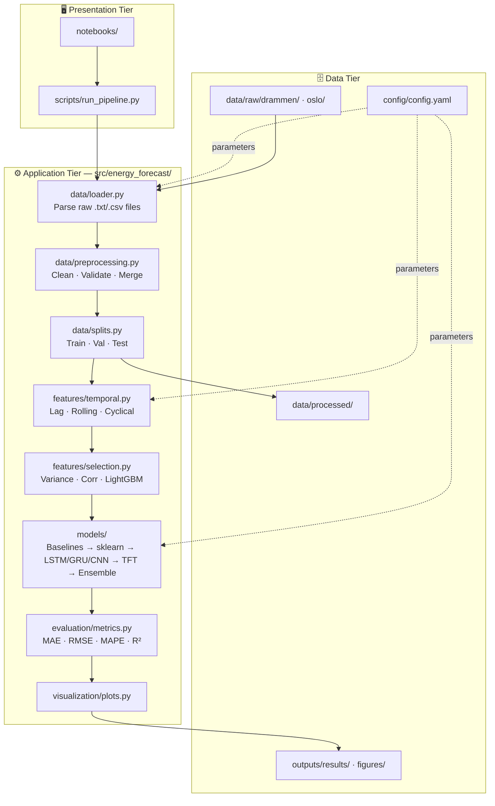
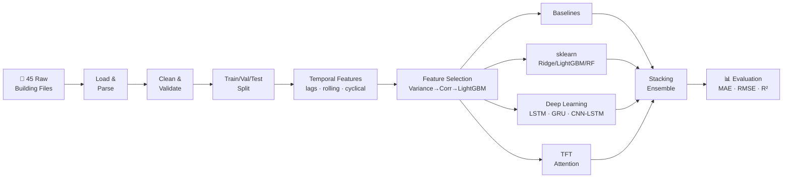
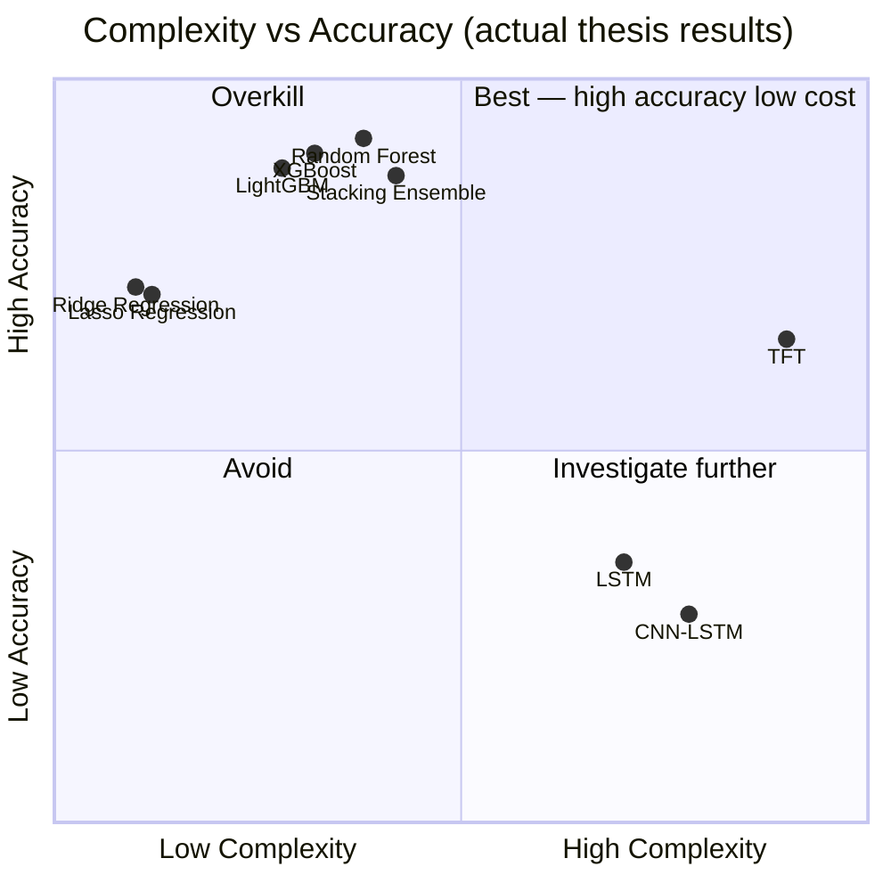

# 🏫 Building Energy Load Forecast

> **24-hour ahead electricity consumption forecasting for Norwegian public buildings**
> MSc Artificial Intelligence thesis — NCI Dublin, 2025
> Dan Alexandru Bujoreanu

[](https://github.com/danbujoreanu/building-energy-load-forecast/actions)
[](https://www.python.org)
[](LICENSE)

---

## Overview

This project develops and compares multiple machine learning approaches for **next-day electricity load forecasting** across 45 Norwegian public school and kindergarten buildings (Drammen, Norway). Accurate day-ahead predictions are critical for energy grid planning, demand response, and reducing peak load costs.

The codebase is a clean, modular refactoring of the original MSc thesis work — designed for **reproducibility, extensibility, and professional readability**. A second dataset (48 Oslo buildings) is pipeline-ready for future transfer learning experiments.

---

## Key Results

> **Thesis finding (2025):** Classical tree-based models outperformed deep learning on this dataset. Random Forest achieved the best MAE while training in under 2 minutes, compared to 6 hours for the Temporal Fusion Transformer.

### MSc Thesis Results (2025) — 24-hour multi-step forecasting

| Rank | Model | MAE (kWh) | RMSE (kWh) | CV(RMSE) % | R² | Train time |
|------|-------|-----------|------------|------------|-----|------------|
| 🥇 1 | **Random Forest** | **3.300** | **6.403** | **14.48** | **0.982** | 1m 56s |
| 🥈 2 | XGBoost | 3.419 | 6.443 | 14.57 | 0.982 | 3s |
| 🥉 3 | LightGBM | 3.578 | 6.679 | 15.10 | 0.980 | 3s |
| 4 | Stacking (LightGBM meta) | 3.582 | 7.030 | 15.81 | 0.978 | <1s |
| 5 | Stacking (Ridge meta) | 3.698 | 7.051 | 15.86 | 0.978 | <1s |
| 6 | Weighted Avg Ensemble | 4.081 | 7.841 | 17.63 | 0.973 | <1s |
| 7 | Lasso Regression | 4.201 | 7.880 | 17.81 | 0.973 | 4s |
| 8 | Ridge Regression | 4.215 | 7.767 | 17.56 | 0.973 | <1s |
| 9 | Persistence (Lag 1h) | 4.561 | 9.587 | 21.67 | 0.959 | — |
| 10 | TFT (Comprehensive) | 5.114 | 10.424 | 23.57 | 0.952 | ⏱ 6h 4m |
| 11 | Seasonal Naive (24h) | 8.762 | 19.383 | 43.82 | 0.834 | — |
| 12 | LSTM | 10.132 | 17.686 | 39.77 | 0.862 | ⏱ 3h 45m |
| 13 | CNN-LSTM | 12.435 | 20.930 | 47.07 | 0.807 | ⏱ 37m |

> *Thesis evaluation: 24-hour ahead multi-step forecasting on Drammen test set (2021-H2, 48 Oslo buildings pipeline-ready). Training on Apple Silicon (MPS).*

### Pipeline v2 Results (2026) — 1-step oracle evaluation

The refactored pipeline uses **1-step-ahead oracle evaluation** (actual past values used as lag features, not recursive predictions). This gives lower MAE but is a different task to the thesis 24h forecast:

| Rank | Model | MAE (kWh) | RMSE (kWh) | R² | Notes |
|------|-------|-----------|------------|-----|-------|
| 🥇 1 | LightGBM | **3.258** | 5.530 | 0.991 | Best non-linear model |
| 🥈 2 | XGBoost | 3.541 | 5.999 | 0.990 | Close second |
| 🥉 3 | Random Forest | 3.629 | 6.563 | 0.988 | — |
| — | Mean Baseline | 27.270 | 45.852 | 0.396 | Non-trivial beat |
| — | Ridge / Stacking | ~0.006 | ~0.011 | ~1.000 | ⚠️ Integer-valued data artefact* |

> *Ridge achieves near-perfect scores because electricity values are stored as integer Wh (÷1000 → exact integers in kWh). With autocorrelation r=0.977, lag_1h almost perfectly predicts the next integer. This is **not data leakage** — it reflects the 1-step oracle setup and integer quantisation. **Use LightGBM MAE=3.258 kWh** as the meaningful pipeline benchmark.

### What changed between thesis and pipeline?

| Aspect | Thesis (2025) | Pipeline v2 (2026) |
|--------|--------------|---------------------|
| Forecast horizon | 24h multi-step | 1-step oracle |
| Train/val/test split | up to 2021-06-30 test | 2018-2020 / 2021 / 2022 |
| Buildings loaded | 45/45 | 43/45 → **45/45** ✓ fixed |
| Imputation | Zero-fill sub-meters | Sparse column filter + median |
| OOF stacking | ✗ (fixed-val) | ✗ pending ROADMAP |
| Weighted Avg Ensemble | ✓ | ✓ added in v2 |
| SHAP explainability | ✗ | ✓ full SHAP suite |

---

## System Architecture

The project implements a **Three-Tier Architecture** with a **Pipe-and-Filter** ML pipeline:



---

## ML Pipeline Detail



---

## Model Complexity vs Accuracy Trade-off

*Applying the MSc Engineering & AI Systems computational complexity framework:*



> **Key takeaway:** Tree-based models (top-left quadrant) dominated. Deep learning models consumed far more compute for *lower* accuracy on this dataset — a finding worth exploring further with Oslo data and transfer learning approaches.

---

## Quick Start

### 1. Clone and install

```bash
git clone https://github.com/danbujoreanu/building-energy-load-forecast.git
cd building-energy-load-forecast

# Option A — conda (recommended, matches thesis environment)
conda create -n ml_lab1 python=3.12
conda activate ml_lab1
pip install -e ".[all]"

# Option B — plain venv
python -m venv .venv
source .venv/bin/activate        # Windows: .venv\Scripts\activate
pip install -e ".[all]"
```

### 2. VS Code — activating the conda environment

VS Code may show `(base)` in the terminal even after selecting the interpreter. To fix:

```bash
# In the VS Code terminal, run:
conda activate ml_lab1

# Or set it permanently for this project (one-time):
echo "conda activate ml_lab1" >> .vscode/.env
```

To select the interpreter: `Cmd+Shift+P` → *Python: Select Interpreter* → choose `ml_lab1`.

### 3. Run the full pipeline

```bash
# Full pipeline — all models, Drammen dataset  (~16 min with --skip-slow)
python scripts/run_pipeline.py --city drammen --skip-slow

# Full pipeline including LSTM / CNN-LSTM / TFT  (~4–6 hours total)
python scripts/run_pipeline.py --city drammen

# Run individual stages
python scripts/run_pipeline.py --city drammen --stages eda
python scripts/run_pipeline.py --city drammen --stages features
python scripts/run_pipeline.py --city drammen --stages training --skip-slow
python scripts/run_pipeline.py --city drammen --stages explain    # SHAP analysis
```

### 4. Generate comprehensive EDA charts

```bash
# All EDA charts (matches original thesis notebook output)
python scripts/generate_eda_charts.py --city drammen

# Also generate per-building energy profiles (~43 buildings)
python scripts/generate_eda_charts.py --city drammen --profiles

# Quick run (skips ACF, decomposition)
python scripts/generate_eda_charts.py --city drammen --quick
```

### 5. View results

```
outputs/
├── results/final_metrics.csv          ← All model metrics (MAE, RMSE, R², MAPE)
└── figures/
    ├── eda/
    │   ├── metadata_overview.png          ← Category / year / floor area / energy label
    │   ├── column_availability.png        ← Sensor heatmap per building (45×N grid)
    │   ├── missing_data_analysis.png      ← Per-column & per-building missing %
    │   ├── temperature_vs_electricity.png ← Scatter by category (75k sample)
    │   ├── acf_pacf.png                   ← Autocorrelation (24h and 168h peaks)
    │   ├── seasonal_decomposition.png     ← Trend / seasonal / residual decomposition
    │   └── building_profiles/             ← Per-building daily + hourly season profiles
    ├── results/
    │   ├── model_comparison_4panel.png    ← MAE / RMSE / R² / MAPE side by side
    │   ├── model_comparison_mae_bar.png   ← Standalone MAE bar chart
    │   └── thesis_vs_pipeline.png         ← Original thesis vs new pipeline comparison
    └── shap/
        ├── shap_beeswarm_{model}.png      ← Feature impact distributions
        ├── shap_bar_{model}.png           ← Mean |SHAP| importance ranking
        └── shap_waterfall_{model}_0.png   ← Single-prediction explanation
```

---

## Project Structure

```
building-energy-load-forecast/
│
├── config/config.yaml             ← All hyperparameters (lookback, horizon, etc.)
│
├── data/
│   ├── raw/drammen/               ← 45 building .txt files (included)
│   └── raw/oslo/                  ← 48 buildings (download separately)
│
├── src/energy_forecast/           ← Python package
│   ├── data/                      ← Parsing, preprocessing, train/val/test splits
│   ├── features/                  ← Temporal encoding, lag, rolling, selection
│   ├── models/                    ← Baselines, sklearn, LSTM/GRU/CNN, TFT, ensemble
│   ├── evaluation/                ← MAE, RMSE, MAPE, R² metrics
│   ├── visualization/             ← All plot functions
│   └── utils/                     ← Config loader, logging, reproducibility
│
├── scripts/run_pipeline.py        ← One command to run everything
├── notebooks/                     ← Clean exploratory notebooks (import from src/)
├── tests/                         ← Pytest test suite (CI-validated)
└── outputs/results/               ← Model comparison table (committed)
```

---

## Datasets

### Drammen (45 buildings) — included
- **Source**: COFACTOR Project, Norway
- **Type**: Schools and kindergartens
- **Period**: 2018–2024, hourly resolution
- **Features**: Electricity (imported, PV, sub-metered), weather (temperature, solar, wind)

### Oslo (48 buildings) — download required
- **Source**: SINTEF / Oslobygg KF
- **DOI**: [10.60609/2hvr-wc82](https://data.sintef.no/product/dp-679b0640-834e-46bd-bc8f-8484ca79b414)
- **License**: CC BY 4.0
- **Pipeline**: Ready — switch `city: oslo` in `config/config.yaml`

---

## Feature Engineering

Three categories of features are engineered from raw hourly data:

| Category | Features | Purpose |
|----------|----------|---------|
| **Cyclical** | hour_sin/cos, day_of_week_sin/cos, month_sin/cos | Captures periodicity without ordinal bias |
| **Lag** | target at t-1, t-2, t-6, t-12, t-24 hours | Autocorrelation structure |
| **Rolling** | 6h/12h/24h/48h mean & std of electricity + temperature | Trend and volatility context |

Feature selection reduces ~200 engineered features to the top 35 via:
1. Variance threshold
2. Correlation filter (ρ > 0.99)
3. LightGBM feature importance ranking

---

## Reproducibility

All random seeds are controlled centrally:

```yaml
# config/config.yaml
seed: 42   # Python, NumPy, TensorFlow, PyTorch
```

Experiments are fully reproducible on the same hardware. GPU is not required (CPU training supported for all models).

---

## Future Work

See [`ROADMAP.md`](ROADMAP.md) for the full prioritised research roadmap drawn from the
MSc thesis Follow-up Questions document (11 questions, PhD-track research).

Top priorities for the next iteration:

- 🔴 **SHAP explainability** — beeswarm + force plots for global and local predictions (Q7)
- 🔴 **Probabilistic forecasting** — quantile regression (P10/P50/P90) in LightGBM & TFT (Q3/Q5)
- 🟡 **Oslo dataset integration** — cross-dataset comparison, transfer learning (Q6)
- 🟡 **Solar/wind imputation** — include the 18%-missing weather features via MICE (Q1)
- 🟡 **OOF stacking** — replace fixed-validation ensemble with out-of-fold meta-features (Q11)
- 🔵 **Hierarchical BART** — partial pooling across buildings, building_id embeddings (Q6)
- 🔵 **FastAPI inference endpoint** — real-time predictions for live deployment (Q8/Q9)

---

## Running Tests

```bash
pip install -e ".[dev]"
pytest tests/ -v --cov=src/energy_forecast
```

---

## Citation

If you use this code or build on this work, please cite:

```bibtex
@mastersthesis{bujoreanu2025energy,
  author  = {Dan Alexandru Bujoreanu},
  title   = {Machine Learning Approaches for Building Energy Load Forecasting
             in Norwegian Public Buildings},
  school  = {National College of Ireland},
  year    = {2025},
  type    = {MSc Artificial Intelligence},
}
```

**Datasets:**
- Lien, S.K. et al. (2025). *Hourly Sub-Metered Energy Use Data from 48 Public School Buildings in Oslo, Norway*. Data in Brief. CC BY 4.0.

---

## Author

**Dan Alexandru Bujoreanu**
- 📧 dan.bujoreanu@gmail.com
- 🎓 MSc Artificial Intelligence, NCI Dublin (2025)
- 💼 [LinkedIn](https://linkedin.com/in/danbujoreanu)

---

*Built with ❤️ and a lot of Norwegian electricity data.*
