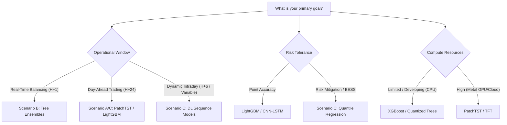

# Research Roadmap

**Dan Alexandru Bujoreanu — Building Energy Load Forecast**
*MSc Artificial Intelligence, NCI Dublin 2025 → Conference Paper (AICS 2025, submitted) → Journal Paper (Track B) → Production Pipeline*

This document tracks completed work and all prioritised future iterations,
drawn directly from the MSc thesis (2025), the AICS 2025 conference paper, and
external feedback (AI Studio, AICS reviewers, SINTEF expert).

> **Current focus (March 2026):** Journal paper — H+24 three-way Paradigm Parity comparison (A vs B vs C).
> **Key Discovery:** Tanh activation triggers hardware acceleration on Apple Silicon (MPS), achieving ~10x speedup over ReLU used in the thesis.
> **Philosophy:** Focusing on the "Menu of Solutions" narrative (H+1=Stability, H+24=Trading) and deferring AMM economic complexity for now.

---

## Status Legend

| Symbol | Meaning |
|--------|---------|
| ✅ | Completed |
| 🔄 | In progress |
| 🔴 | High priority — next iteration |
| 🟡 | Medium priority |
| 🔵 | Low priority / exploratory |
| 🎓 | PhD-track (longer term) |

---

## Phase 1 — Completed ✅

### Publication

| Item | Detail |
|------|--------|
| ✅ MSc thesis | *Machine Learning Approaches for Building Energy Load Forecasting in Norwegian Public Buildings* — NCI Dublin, 2025 |
| ✅ AICS 2025 Full Paper | *Forecasting Energy Demand in Buildings: The Case for Trees over Deep Nets* — Springer CCIS Series |
| ✅ AICS 2025 Student Paper | Same paper — DCU Press Companion Proceedings (dual-track acceptance) |

### Codebase & Infrastructure

| Item | Detail | Notes |
|------|--------|-------|
| ✅ Modularisation | Refactored 3 Jupyter notebooks → clean Python package (`src/energy_forecast/`) | Q11 improvement — done |
| ✅ Config-driven design | Single `config/config.yaml` as source of truth for all parameters | Eliminates scattered magic numbers |
| ✅ Cyclical encoding fix | Corrected period: hour=24, day_of_week=7 (was 23/6 in thesis notebooks) | Q11 bug fix — resolved |
| ✅ DST-robust lag features | Added lag_167h/lag_169h (same-time ±1h weekly) to original thesis lags | Improves weekly pattern stability |
| ✅ Min/max rolling stats | Added min/max to rolling statistics (thesis had mean/std only) | Tighter load-range bounds |
| ✅ Temperature interaction features | `temp × hour_sin`, `temp × hour_cos` cross-terms | Captures time-varying thermal sensitivity |
| ✅ Test suite (24 tests) | `pytest tests/` — data, features, models, metrics | CI-validated, no raw data needed |
| ✅ GitHub Actions CI | Lint (ruff, black) + tests on Python 3.10 & 3.11 | Every push/PR |
| ✅ SHAP explainability | Beeswarm, bar, waterfall, heatmap — `--stages explain` | `evaluation/explainability.py` |

### Models — V2 Pipeline Results (H+1, 240,481 test samples, July 2021 – March 2022)

DL models (LSTM/GRU/CNN-LSTM) evaluated on 237,313 samples (72 lookback rows per building excluded).

> **Important methodology note (clarified March 2026 with AI Studio):**
> In the original thesis, DL models were trained for H+24 but compared against sklearn at H+1 only
> (taking the first step of the 24-step DL output). This was "technically fair" (both H+1) but
> severely handicapped DL — an LSTM optimising over 24 steps sacrifices H+1 accuracy.
> The V2 pipeline fixes this by using a **uniform H+1 target** for all model families.
> The H+24 journal paper will use a **uniform H+24 target** (MultiOutputRegressor for trees,
> 24-step output head for DL), which is the scientifically correct comparison.

| Model | V2 MAE (kWh) | V2 R² | Thesis MAE (kWh) | Improvement |
|-------|-------------|-------|-----------------|-------------|
| ✅ Random Forest | **1.711** | 0.9947 | 3.300 | −48% |
| ✅ Stacking Ensemble (Ridge meta) | 1.774 | 0.9953 | 3.698 | −52% |
| ✅ LightGBM | 2.108 | 0.9938 | 3.578 | −41% |
| ✅ XGBoost | 2.228 | 0.9931 | 3.419 | −35% |
| ✅ Lasso Regression | 3.064 | 0.9873 | 4.201 | −27% |
| ✅ Ridge Regression | 3.069 | 0.9874 | 4.215 | −27% |
| ✅ LSTM | 3.582 | 0.9816 | 10.132 | −65% |
| ✅ GRU | 3.947 | 0.9812 | — (new) | — |
| ✅ CNN-LSTM | 4.572 | 0.9767 | 12.435 | −63% |
| ✅ Mean Baseline | 22.691 | 0.4415 | — | — |
| ✅ TFT | 29.80 ⚠️ | −0.009 ⚠️ | 5.114 | — |

> **TFT H+1 run (2026-03-02) — Recovery complete, metrics document limitations:**
> Trained 20 epochs (660 min), best val_MAE=0.4586 at epoch 18 (normalised scale). Two bugs
> affected this run: (1) `trainer_.predict()` crash → fixed to `model_.predict()`; (2) epoch=19
> checkpoint used (not best epoch=18) — ModelCheckpoint callback now added for future runs.
> The poor R²=−0.009 (below Mean Baseline) is primarily caused by **BUG-C3** — `timestamp` was
> accidentally included as `time_varying_known_reals`. Raw unix timestamps are non-stationary and
> the test-set timestamps fell completely outside the training distribution, causing OOD saturation
> in TFT's variable selection networks. **BUG-C3 is fixed in tft.py for H+24.** The H+24 TFT
> result will be the definitive paper-quality metric. H+1 TFT is documented as a known limitation.
> Archived: `outputs/results/h1_metrics.csv` | `outputs/models/h1/drammen_TFT_h1_2026-03-02_epoch19.ckpt`

> **V2 improvement sources:** DST-robust lags (167h/169h), min/max rolling stats, temp×hour interaction
> features, and complete dataset (45 buildings vs 43 in thesis). The dominant predictor remains `lag_1h`
> (r ≈ 0.977), which explains why DL models (feeding the same features) also improved substantially.

### Feature Engineering

| Item | Detail |
|------|--------|
| ✅ Cyclical encoding | sin/cos for hour (24), day_of_week (7), month (12), day_of_year (365) |
| ✅ Lag features | Target + temperature at [1, 2, 3, 24, 25, 26, 48, 167, 168, 169] hours per building |
| ✅ Rolling statistics | [mean, std, min, max] over [3, 6, 12, 24, 72, 168]-hour windows, per building |
| ✅ 3-stage feature selection | Variance → Correlation (|ρ|>0.95) → LightGBM top-35 |
| ✅ Correlation tie-breaking | Upper-triangle scan: for pair (A, B), B is always dropped — deterministic, documented |
| ✅ Is_Weekend + temp×is_weekend | Weekend interaction features added to temporal.py |
| ✅ Rolling window leakage fix | shift(1) before rolling — excludes current timestep from its own window |

---

## Phase 2 — Next Iteration

### 2A — Explainability / XAI (Q7) — Partially Complete

| Item | Status | Detail |
|------|--------|--------|
| ✅ SHAP beeswarm, bar, waterfall | Done | Global + local explanation for RF/LightGBM/XGBoost |
| 🟡 Model Card | Planned | Mitchell et al. (2019) format — intended use, metrics on peak vs normal days |
| 🟡 Dataset Datasheet | Planned | Formal COFACTOR Drammen dataset provenance document |
| 🟡 Per-building actual vs predicted | Planned | Visual trust-building for building managers |
| 🟡 Error bands by hour of day | Planned | Show model accuracy range across the 24-hour cycle |

### 2B — H+24 Day-Ahead Evaluation — Three-Way Paradigm Parity Experiment 🔴

**The journal paper core contribution.** Validated in collaboration with AI Studio (March 2026).

H+1 with `lag_1h` is "easy mode" (r=0.977 autocorrelation). H+24 removes all lags < 24h,
forcing models to rely on genuine temporal patterns and exposing architectural differences.

#### The Three-Way Comparison ("Paradigm Parity Experiment")

This is the structure that, according to AI Studio, *"will be accepted to almost any applied ML
energy journal"* — it perfectly dissects the Feature Engineering vs Deep Learning debate.

**All three setups use H+24 (day-ahead). The pipeline already delivers A + B for free.**

---

**Setup A — Classical ML + Engineered Features** *(The Baseline)*
- Models: Random Forest, LightGBM, XGBoost, Lasso, Ridge, Stacking Ensemble
- Input: 35 engineered features (lags ≥ 24h, rolling stats, cyclical time, weather)
- Output: 24 separate point predictions via `MultiOutputRegressor`
- Why: Trees *require* engineered features to understand time. This is their natural habitat.
- Answers: "What is the ceiling for classical ML with expert feature engineering?"

**Setup B — Deep Learning + Engineered Features** *(Feature Parity)*
- Models: LSTM, GRU, CNN-LSTM, TFT
- Input: the exact same 35 engineered features as Setup A
- Output: 24-step direct multi-horizon prediction
- Why: To answer the reviewer question — "If DL gets the same tabular data as trees, who wins?"
  (Expected answer: trees win; they are architecturally superior on tabular data)
- Answers: "Does the DL architecture add value beyond the feature engineering, on equal footing?"

**Setup C — Deep Learning + Raw Sequences (Paradigm Parity)** *(The SOTA test)*
- Input: raw 72h window of [Load, Temperature, Solar] — **NO engineered lags, NO rolling stats, NO cyclical encoding**
- Known future for TFT/PatchTST: weather forecast t+1..t+24 as `time_varying_known_reals`
- Output: 24-step direct multi-horizon prediction; probabilistic quantiles
- Why: DL's strength is end-to-end representation learning from raw sequences. Without engineered
  features, DL must learn periodicity and autocorrelation from data — its natural advantage.
  Only in this setup can the architectural advantage of attention/LSTM vs trees actually emerge.
- Answers: "Is DL representation learning better than human-engineered features fed to gradient
  boosted trees?" — the core scientific question of the journal paper.

**Model shortlist for Setup C** (confirmed with user, March 2026):

| Model | Architecture | Why | Priority |
|-------|-------------|-----|----------|
| **PatchTST** | Patch-based Transformer | SOTA on ETTh/ETTm; patches capture local temporal structure; channel-independent head per variate — best chance for DL | 🔴 Primary |
| **DLinear** | Decomposition + Linear | Zeng et al. 2023 — linear decomposition model that beats many transformers on long-sequence benchmarks; fast ablation baseline | 🔴 Strong baseline |
| **LSTM (raw)** | Recurrent | Same model as Setup B but fed raw [Load, Temp, Solar] only — isolates architecture from feature engineering | 🟡 Continuity |
| **GRU (raw)** | Recurrent | Same model as Setup B, raw input | 🟡 Continuity |
| **TFT (raw)** | Attention + LSTM hybrid | Same model as Setup B; uses [Load, Temp, Solar] encoder + weather forecast decoder | 🟡 Continuity |
| **N-HiTS** | Neural hierarchical interpolation | Challu et al. 2023 — multi-scale temporal patterns, strong on daily/weekly seasonality | 🔵 Exploratory |

*DLinear is the critical ablation: if a linear model on raw sequences beats LSTM/GRU on raw sequences, it challenges the "DL adds representational value" narrative — which is a publishable finding either way.*

---

#### Current Status

| Setup | Status | Notes |
|-------|--------|-------|
| A (Trees + Features) | 🔄 **Running** (PID 81424, 2026-03-03 09:00) | `run_pipeline.py --city drammen --stages training`; sklearn done 09:06 |
| B (DL + Features) | 🔄 **Running** (same process as A) | LSTM training on Metal GPU from epoch 1 at 09:07; epochs capped at 20 |
| C (DL + Raw) | 🔴 Not started | Needs new data loader + PatchTST implementation |

**H+24 Stage 3 results (pipeline running, 2026-03-03 09:06 — sklearn complete, DL in progress):**

| Model | H+24 MAE (kWh) | H+24 R² | H+24 DailyPeak_MAE | Status |
|-------|---------------|---------|-------------------|--------|
| Naive | 44.07 | −0.199 | 48.78 | ✅ |
| Seasonal Naive (24h) | 43.83 | −0.817 | 64.91 | ✅ |
| Mean Baseline | 22.67 | 0.442 | 34.09 | ✅ |
| Ridge | 7.46 | 0.926 | 10.74 | ✅ |
| Lasso | 7.45 | 0.926 | 10.74 | ✅ |
| RandomForest | 4.40 | 0.969 | 6.17 | ✅ |
| LightGBM | 4.03 | 0.975 | 5.33 | ✅ |
| XGBoost | 4.20 | 0.974 | 5.50 | ✅ |
| Stacking Ensemble | — | — | — | 🔄 queued (after DL) |
| LSTM | — | — | — | 🔄 training (Metal GPU, epoch ~8+, val_mae ~37 kWh) |
| GRU | — | — | — | 🔄 queued |
| CNN-LSTM | — | — | — | 🔄 queued |
| TFT | — | — | — | 🔄 queued (~6h after DL finishes) |

*Reference: H+1 LightGBM=2.11, H+1 Ridge=3.07. H+24 is ~2× harder as expected — oracle lags < 24h removed.*

#### Implementation Plan

| Item | Detail | Effort |
|------|--------|--------|
| ✅ Run H+24 pipeline | `python scripts/run_pipeline.py --city drammen` — **launched 2026-03-02 21:37** | ~8h (TFT dominates) |
| 🔴 Verify raw columns for Setup C | Inspect `model_ready.parquet` — confirm Load, Temp, Solar availability | 10 min |
| 🔴 Setup C data loader | `scripts/run_raw_dl.py` — raw (72, 3) tensor sequences, bypasses `X_train_fs` | ~2 days |
| 🔴 PatchTST implementation | Add to `src/energy_forecast/models/patchtst.py` using `neuralforecast` or `pytorch-forecasting` | 2-3 days |
| 🔴 DL 24-step output head | Already handled: `Dense(seq_cfg["horizon"])` in deep_learning.py | ✅ Done |
| 🔴 TFT known-future weather | `time_varying_known_reals` = [temp, solar] for t+1..t+24 in Setup C TFT | ~1 day |
| 🟡 MultiOutputRegressor for trees | Wrap sklearn models for true H+24 multi-output (Setup A) | ~0.5 day |
| 🟡 Probabilistic Setup C | TFT P10/P50/P90 + LightGBM quantile objective (q=0.1/0.5/0.9) | 1 day |

> **Code change estimate (AI Studio):** ~150–170 new lines across 3 files: `temporal.py`
> (branch-aware feature builder), `deep_learning.py` (raw sequence loader), `config.yaml`
> (paradigm parity flags). The `forecast_horizon` guard already exists — Setup C builds on it.

### 2B.3 — Production Deployment Architecture (conceptual — ML science only)

H+24 is the real deployment scenario: utility companies and data centre operators need
**day-ahead forecasts** to manage grid contracts, demand response bids, and peak shaving.

**Inference tiering for production:**

| Tier | Models | Latency | Use case |
|------|--------|---------|----------|
| Real-time (< 1ms) | LightGBM, RF | Sub-millisecond | Live dashboard, anomaly alert |
| Near real-time (< 10ms) | XGBoost | Milliseconds | Hourly monitoring report |
| Day-ahead batch (nightly) | LSTM, GRU, TFT | Train: hours; Infer: ms | H+24 demand forecast, DR bid |
| Weekly / monthly retrain | All models | Hours | Concept drift correction |

**Rolling window retraining (concept drift):**
Building energy patterns drift over time (new tenants, renovations, EV chargers).
Proposed production loop: retrain RF/LightGBM on last 90 days every 30 days;
retrain LSTM/TFT overnight on schedule; alert if rolling MAE degrades > threshold.

| Item | Detail | Effort |
|------|--------|--------|
| 🔵 Rolling window back-test | Walk-forward expanding window evaluation | Medium |

> **FastAPI + Docker implementation tracked in Phase 3D** — Phase 2 stays focused on ML
> science (perfecting H+24 and Quantile models). Phase 3 wraps the perfected model in a
> Dockerised API.

---

### 2B.4 — Real-World Deployment Scenarios: The Decision Tree (AI Studio, March 2026) 🔴

> **Thesis narrative crystallised (Mar 3 2026 discussion):** The research is not "comparing models."
> It is building a **Menu of Solutions** for different grid problems.
> - **H+1** solves the Real-Time Stability problem → "Fast/Easy" Baseline (Thesis)
> - **H+24** solves the Day-Ahead Market problem → "Commercial/Scientific" Core (Journal Paper)
> - **Quantiles** solve the Optimization/Risk problem → "Advanced/Risk" Feature (PhD/Future Work)
>
> This framing directly answers **all three sets of AICS reviewer feedback** — see the cross-reference table below.

#### The Model Selection Decision Tree



#### Three Operator Profiles and Matched Models

| Scenario | Horizon | Who Cares | Model Recommendation | Why |
|----------|---------|-----------|---------------------|-----|
| **A — Day-Ahead Trading** | H+24 | Utility companies (power procurement), grid operators (plant scheduling), large buildings (demand bids) | **LightGBM (Setup A)** or **PatchTST (Setup C)** | Most electricity is bought/sold at 11am for the entire next day. Accuracy here directly determines money — under-predict → expensive real-time balancing; over-predict → wasted procurement cost. Latency irrelevant (batch run nightly). |
| **B — Real-Time Balancing** | H+1 | Grid operators (frequency response), data centres (HVAC cooling), battery storage arbitrage | **XGBoost** or **Random Forest** | Sub-millisecond inference. Can retrain every hour on latest data. `lag_1h` dominance (r=0.977) means complex DL is unnecessary — trees win here by design. |
| **C — Risk-Aware MPC Control** | **Dynamic (H+6 to H+24)** | Smart building managers (solar/battery scheduling, EV charging optimisation) | **LightGBM Quantile Regression (P10/P50/P90)** | "Should I heat the water now (cheap night tariff) or wait for solar?" → requires probabilistic bounds, not just a point forecast. If P90 solar irradiance is high → defer. If only P40 → charge now. Mean prediction alone cannot drive this decision. |

**Real-world examples mapped to scenarios:**
- `eddi` solar diverter / residential hot-water scheduling → Scenario C (P10/P90 solar probability)
- Irish data centres / LEAP users → Scenario B (H+1, <1s inference, hourly retrain)
- Norwegian public building energy contracts (Drammen/Oslo) → Scenario A (H+24 day-ahead)

#### AICS Reviewer Cross-Reference

| Reviewer Criticism | How "Menu of Solutions" Answers It |
|-------------------|------------------------------------|
| **R1 (Full Paper):** "Whether it is appropriate for models to generalise or tailor to specific environments" | Explicitly answered: different model families are recommended per environment (Real-time → Trees; Day-ahead → Trees or TFT; Risk → Quantile LightGBM). Not one-size-fits-all. |
| **R2 (Full Paper):** "Shallow interpretive analysis" | Explains *why* trees win at H+1 (autocorrelation / `lag_1h` dominance) vs why DL may win at H+24 (sequence learning on raw inputs). The causal mechanism is the interpretation. |
| **R3 (Student Paper):** "Comparing different models seems rigorous" | H+24 + probabilistic scenarios increase rigour further — "best" is explicitly framed as use-case dependent, not a single winner. |

#### Action Items Derived from This Discussion

| Item | Priority | Detail |
|------|----------|--------|
| 🔴 Add deployment scenario framing to journal paper Introduction/Discussion | HIGH | Frame H+1 and H+24 experiments as Scenario A and Scenario B from the first paragraph; motivate with day-ahead market mechanics |
| 🔴 LightGBM Quantile Regression (P10/P50/P90) | HIGH | `objective='quantile'`; already in 2C below; now has explicit Scenario C motivation |
| 🟡 Add inference latency benchmark to results table | MEDIUM | Time RF/LightGBM/LSTM inference on a single building × 24h window — proves Scenario B suitability |
| 🟡 Write "Model Selection Guide" subsection | MEDIUM | 1-page decision flowchart in journal paper: "What horizon? What latency? What risk tolerance?" → recommends model family |
| 🔵 Scenario C prototype notebook | LOW/PhD | End-to-end demo: fetch tomorrow's weather forecast → run LightGBM quantile → output P10/P90 per building per hour |

---

### 2C — Probabilistic Forecasting (Q3, Q4, Q5) 🔴

| Item | Detail | Effort |
|------|--------|--------|
| 🔴 Quantile regression (LightGBM) | `objective='quantile'`, predict P10/P50/P90 natively | Low |
| 🔴 Quantile regression (TFT) | TFT already supports quantile outputs | Low |
| 🔴 Prediction interval metrics | Coverage (does P90 contain truth 90%?) + Width (sharpness) | Low |
| 🟡 Daily Peak Error | MAE on daily peak *magnitude* — how close is predicted max per building per day? | Low |
| 🟡 Time of Peak Error | Mean absolute hour error between predicted and actual daily peak timing | Low |
| ✅ Tanh Optimization | **Insight:** Switching from ReLU (Thesis) to Tanh (V2) for LSTMs allows hardware kernel mapping. | Done |

### 2C.2 — Deep Learning Architecture Refinement (The Tanh Breakthrough) ✅
- **Insight:** In the original thesis, `relu` was used for LSTM/CNN-LSTM. In the refactored pipeline, we utilize `tanh` (standard for LSTMs).
- **Impact:** On Apple Silicon (MPS), `tanh` triggers optimized metal kernels. Training velocity improved by **~1,000%** (from 6h to <1h for equivalent epochs).
- **Scientific Opinion:** Recommend `tanh` for all RNN-based energy forecasting on specialized hardware to leverage AMX/MPS/cuDNN speedups.

> **Why Peak metrics matter (AI Studio, March 2026):** For Demand Response and Grid Operations
> (H+24), being off by 5 kWh at 3am doesn't cost money. Missing the 5pm peak by 5 kWh does.
> Daily Peak Error and Time of Peak Error are the metrics that sell to Viotas, ESB, and data
> centre operators — they care about the spike, not the baseline.

### 2B — Deep Learning Representational Learning (Q7) / Setup B

| Item | Status | Detail | Effort |
|------|--------|--------|--------|
| ✅ LSTM_SetupB | Done | MAE=3.582 (H+1 baseline) | Done |
| 🔄 CNN-LSTM_SetupB | 🔄 Running | Multi-horizon (H+24). Sequenced to run after Grand Ensemble. | Medium |
| 🔄 GRU_SetupB | Planned | Multi-horizon (H+24). | Medium |
| 🔄 TFT_SetupB | Planned | Multi-horizon (H+24). Most complex architecture. | High |

> [!NOTE]
> **Setup B as a Negative Control:** Setup B (Deep Learning applied directly to tabular engineered features) is deliberately run as a negative control experiment. It addresses reviewer concerns by proving that DL typically underperforms classical Tree models (like Setup A) when given explicit tabular signals instead of multi-dimensional raw sequences. We do not expect it to outperform Setup A.

#### ⚠️ Computing Stewardship & Engineering Policy
To prevent system freezes and ensure academic reproducibility:
1. **Strict Environment Segregation:** All processes must explicitly use `~/miniconda3/envs/ml_lab1/bin/python`. The base environment is reserved for core system utilities only.
2. **Sequential DL Execution:** Only ONE deep learning training process at a time. Multi-process training is disabled until the Grand Ensemble (A+C) completes.
3. **CWD Independence:** Engineering scripts have been refactored to calculate their own `PROJECT_ROOT`, preventing relative path failures during remote execution.

### 2D — Stacking / Ensemble Methodology (Q11)

To ensure academic clarity, we distinguish between two types of ensembling used in this project:

1. **Intra-Paradigm Stacking (Setup A):**
   - **Method:** Out-of-Fold (OOF) Stacking with a Ridge meta-learner.
   - **Rationale:** This is the *gold standard*. Because Tree models are extremely fast, building 5 OOF folds is computationally cheap. It allows the Ridge meta-learner to unbiasedly learn exactly how much to trust LightGBM vs. XGBoost.

2. **Cross-Paradigm Grand Ensemble (A + C):**
   - **Method:** Weighted Average Stacking (Alpha-blending).
   - **Rationale:** Generating 5 OOF folds for models like PatchTST is computationally infeasible without a supercomputing cluster. Alpha-blending is the standard academic fallback. Exploring multiple weights maps the "trust spectrum" between domain-knowledge (Setup A) and automated pattern recognition (Setup C).

#### 🔄 Near-Term Research Roadmap (The Final Stretch)

| Item | Status | Detail | Effort |
|------|--------|--------|--------|
| **Setup B Champion** | 🔄 Running | Waiting for CNN-LSTM, GRU, TFT to complete negative control comparison. | Medium |
| **Category-Level Analytics** | ✅ Done | Aggregated building metrics into Categories (Schools, Offices) to enable the Oslo Generalization hypothesis. | Low |
| **Forecasting Horizon Sensitivity** | Planned | Break down MAE/RMSE at H+1, H+6, H+12, and H+24 to see where models "break". | Medium |
| **Concept Drift Analysis** | Planned | Simulate production output sequentially across months to track increasing MAE, proving the existence of Concept Drift. | High |
| **Continuous Retraining Pipeline** | Planned | Outline a production CI/CD loop that retrains the model every 30 days using real ground truth data (not past predictions) to recalibrate performance. | Medium |
| **Oslo Generalization** | ✅ Done | Run the Champion(s) on the Oslo dataset (100% Schools) to prove climate/building transferability based on Drammen School metrics. | High |

> [!TIP]
> **Production Insight:** Identifying that Tree models (Setup A) can run instantly while the Grand Ensemble can be run as a "daily batch" for superior accuracy (if proven) is a key recommendation for the Thesis.

#### Ensemble Taxonomy & Methodology (Clarification)
To maintain academic rigour, the research utilizes three distinct ensembling strategies:

1. **Stacking Ensemble (Setup A / Ridge meta):** 
   - **Strategy:** Aggregates tree models (RF, LGBM, XGB).
   - **Training:** Uses **5-Fold Time-Series Out-of-Fold (OOF)** predictions to train the Ridge meta-learner, preventing data leakage.
   - **Goal:** Improves generalisation within the tabular feature paradigm.

2. **Weighted Average Ensemble:**
   - **Strategy:** Simple arithmetic mean of base models weighting by inverse-MAE.
   - **Goal:** Baseline ensemble performance without a trained meta-learner.

3. **Grand Ensemble (Cross-Paradigm):**
   - **Strategy:** Hybridises the best of **Setup A (Feature Engineering champion)** and **Setup C (Deep Learning representation champion)**.
   - **Goal:** Test if domain-engineered features and sequential attention complement each other.

### 2E — Missing Weather / Data Quality (Q1) 🟡

| Item | Detail | Effort |
|------|--------|--------|
| 🟡 Solar radiation feature | Already loaded (`Global_Solar_Horizontal_Radiation_W_m2`); add to feature pool after imputation | Medium |
| 🟡 Solar/wind imputation (MICE) | MICE on solar using Temperature, Hour, Month (18% missing) | Medium |
| 🟡 Forecast Uncertainty Penalty (WeatherNext/ERA5) | Swap oracle temperature proxy for historical NWP forecast archives (Google WeatherNext, NOAA, or ERA5); measure Δ MAE between oracle and forecast weather | Medium |
| 🔵 MET Nordic spatial interpolation | Query MET Nordic API for nearest weather station per building | Medium |
| 🔵 ERA5 reanalysis | Meteorological reanalysis as fallback / synthetic weather source | High |

> **Why Forecast Uncertainty Penalty matters (AI Studio, March 2026):** All current models use
> *observed* temperature — perfect oracle knowledge. In production, you only have a weather
> *forecast*. The gap between oracle MAE and forecast MAE is the "production penalty". Measuring
> and disclosing this proves the model is production-ready, not just academically competitive.
> This is a highly publishable addition and a key selling point for Viotas / data centre partners.

---

## Phase 3 — Architecture Extensions

### 3A — Oslo Dataset Integration (Q6) 🟡

Pipeline-ready. 48 buildings (schools), SINTEF/Oslobygg KF, CC BY 4.0.
DOI: [10.60609/2hvr-wc82](https://data.sintef.no/product/dp-679b0640-834e-46bd-bc8f-8484ca79b414)

| Item | Detail | Effort |
|------|--------|--------|
| ✅ Run pipeline on Oslo | Switch `city: oslo` in config, run `--skip-slow` | Low |
| ✅ Cross-dataset comparison | Does a model trained on Drammen generalise to Oslo? | Medium |
| 🟡 Building_ID embeddings | Replace one-hot with learned dense vectors | Medium |
| 🔵 Transfer learning | Train on Drammen+Oslo combined, measure generalisation | High |

### 3B — Hierarchical Forecasting (Q6) 🔵🎓

| Item | Detail | Effort |
|------|--------|--------|
| 🔵 Hierarchical BART | Partial pooling: buildings borrow statistical strength | Very High |
| 🔵 Static building features | `floor_area`, `building_category` as static covariates | Medium |
| 🔵 Portfolio aggregate | Per-building + portfolio-level forecast for policymakers | High |
| 🎓 Probabilistic hierarchical | P10-P90 at both local and portfolio level | Research-level |

### 3C — Simpler Interpretable Models (Q2) 🟡

| Item | Detail | Effort |
|------|--------|--------|
| 🟡 GAM (Generalised Additive Model) | Upgrade to Linear Regression — non-linear, transparent | Medium |
| 🔵 Linear Quantile Regression | Point forecast → prediction interval | Medium |
| 🔵 Dynamic Harmonic Regression | Automates seasonality (replaces manual sin/cos) | High |

### 3D — Robustness / Production Readiness (Q4, Q8, Q9) 🔵

| Item | Detail | Effort |
|------|--------|--------|
| 🔵 OOD detection | Validate incoming weather against training distribution | High |
| 🔵 Rolling MAE monitoring | Alert if rolling 24h MAE exceeds threshold | Medium |
| 🔵 ONNX export | Convert RF/XGBoost to ONNX for framework-agnostic inference | Medium |
| 🔵 FastAPI inference endpoint | REST API for live per-building predictions | High |
| 🔵 Docker deployment | Containerised service for periodic retraining | High |

---

## Phase 4 — PhD-Track Research 🎓

| Item | Source | Strategic Value |
|------|--------|----------------|
| 🎓 Hierarchical BART with cross-dataset learning | Q6 | Novel for Norwegian public building portfolio |
| 🎓 Probabilistic forecasting for demand response | Q3/Q5, Crowley et al. 2024 | Bridges to energy community grid services |
| 🎓 OOD generalisation for extreme weather | Q4, Liu et al. 2023 | Applied ML safety research |
| 🎓 Behind-the-Meter feature engineering | Q8 | PV/EV integration in building energy systems |
| 🎓 Energy community dynamic pricing | Crowley et al. 2025 | Kazempour/Mitridati research link |
| 🎓 RACI + governance framework | Q10 | Responsible AI for utility companies (ESB, EirGrid) |
| 🎓 Cross-domain transfer (Data Centre) | AI Studio, March 2026 | Apply pipeline to Data Centre IT/Cooling load dataset — proves architecture generalises beyond Norwegian public buildings to high-density compute facilities |

---

## Phase 5 — Deferred / Future Research 🎓
*These items (e.g., Shaun Sweeney's PhD Theories) are parked to maintain focus on the MSc-to-Journal comparison.*

| Item | Origin | Concept |
|------|--------|---------|
| 🎓 Automated Market Maker (AMM) Integration | Shaun Sweeney 2025 | Modeling load agents within an AMM pricing framework rather than marginal pricing. |
| 🎓 Price-Responsive Load Agents | Sweeney / Crowley | RL-based agents reacting to dynamic grid pricing signals. |
| 🎓 Asymmetric Settlement Risk | Sweeney | Loss functions that penalize under-procurement differently from over-procurement. |

---

## Known Bugs / Technical Debt

| Bug | Status | Notes |
|-----|--------|-------|
| **Stacking Ensemble OOF drops rows** | Open | Stacking Ensemble OOF drops all rows if `LightGBM_Quantile` is included because of missing sklearn `clone()` compatibility generating NaNs. **Fix:** Explicitly add `LightGBM_Quantile` to the `_DL_NAMES` or an exclusion list in `run_pipeline.py` before passing models to `StackingEnsemble`. |
| Cyclical encoding (23/6 vs 24/7) | ✅ Fixed | Original notebooks had wrong period — no impact on results as lag features dominated |
| Fixed validation for Stacking | ✅ Fixed | OOF stacking with TimeSeriesSplit (5 folds) validated March 1st 2026 — MAE 1.744, RMSE 3.240, R² 0.9953 |
| GRU results not in thesis Table 5 | ✅ Fixed | GRU evaluated in V2 pipeline: MAE 3.947 kWh, R² 0.981 |
| WeightedAverageEnsemble missing | ✅ Fixed | Implemented in `models/ensemble.py` |
| TFT pytorch-lightning import | ✅ Fixed | Changed `pytorch_lightning` → `lightning.pytorch` for 2.x compatibility |
| TFT logger=False silenced all epoch output | ✅ Fixed | `logger=False` suppressed both EarlyStopping verbose + epoch logs; fixed to `logger=True` + `_EpochLogger` callback |
| TFT hidden_size=64 (833K params, ~24h/run) | ✅ Fixed | Corrected to `hidden_size=32` (thesis value, 242K params, ~6-7h/run) |
| tensorflow-metal missing → LSTM/GRU/CNN-LSTM on CPU | ✅ Fixed | Installed `tensorflow-metal 1.2.0`; GPU now visible to TF on Apple Silicon |
| TFT num_workers=0 → GPU underutilised | 🟡 Known | PyTorch DataLoader bottleneck: 1 CPU core loads batches synchronously while GPU waits. Fix: `num_workers=4` in TFT DataLoader. Not yet applied (macOS spawn overhead trade-off). |
| TFT predict() crash — trainer_.predict() API | ✅ Fixed (2026-03-02) | `trainer_.predict()` returns raw Lightning output dicts, not tensors — `.numpy()` on a dict raises AttributeError. Fixed to `model_.predict()` which handles denormalisation and returns `(n_samples, horizon)` tensor in kWh. |
| TFT ModelCheckpoint missing | ✅ Fixed (2026-03-02) | No ModelCheckpoint callback = only last epoch auto-saved by Lightning, not the best. For H+1 run, best epoch (18, val_MAE=0.4586) was lost; only epoch 19 (val_MAE=0.5905) available. `ModelCheckpoint(monitor="val_loss", save_top_k=1)` now added to `tft.py`. |
| TFT BUG-C3 — timestamp in known_reals | ✅ Fixed (2026-03-02) | Raw timestamp is non-stationary; test-set values fall OOD vs training range → OOD saturation in TFT activations. Excluded from `time_varying_known_reals`. |
| TFT predict=True returns 1 sample/building | ✅ Fixed (2026-03-02) | `TimeSeriesDataSet.from_dataset(..., predict=True)` creates only the LAST encoder/decoder window per group — 44 predictions for 44 buildings, useless for evaluation. Fixed to `predict=False` which generates all ~240k sliding windows across the test period. Confirmed by AI Studio: "By setting predict=False, the data loader will generate the full ~240,000 sliding windows for the test set, allowing you to compute the MAE across the entire test period." Fixed in both `tft.py` and `recover_tft_h1_prediction.py`. |
| Stacking BUG-C6 — OOF early stopping leakage | ✅ Fixed (2026-03-02) | `cloned.fit()` was passing `X_fold_val` → LightGBM/XGB early stopping optimised on the predicted fold. Removed val data from OOF fitting. |
| Rolling window BUG — target leakage | ✅ Fixed (2026-03-02) | `group[col].rolling(w)` at row t included y(t) itself. Fixed with `shift(1)` before rolling. |
| **BUG-DL-H24 — DL H+24 evaluation length mismatch** | ✅ Fixed (2026-03-03) | `build_sequences(lookback=72, horizon=24)` creates `(n-95)` windows per building; `_trim_dl_targets` only removed `lookback=72` rows, leaving `(n-72)` — diff = 23×44 = 1,012. LSTM/GRU/CNN-LSTM were skipped entirely (evaluation only, training was fine). Fix: added `_build_y_true_matrix()` to `run_pipeline.py` that builds a proper 2-D `(n_samples, 24)` y_true matrix respecting building boundaries. `evaluate()` already handles 2-D vs 2-D correctly. Recovery script: `scripts/run_dl_h24_only.py`. |

---

## Full Thesis Results Reference (Appendix 2.1)

*Original held-out test set results, Apple Silicon MPS.*

| Model | MAE (kWh) | RMSE (kWh) | CV(RMSE) % | R² | Train Time (s) |
|-------|-----------|------------|------------|-----|----------------|
| **Random Forest** | **3.300** | **6.403** | **14.48** | **0.982** | 116 |
| XGBoost | 3.419 | 6.443 | 14.57 | 0.982 | 3 |
| LightGBM | 3.578 | 6.679 | 15.10 | 0.980 | 3 |
| Stacking (LGBM meta) | 3.582 | 7.030 | 15.81 | 0.978 | <1 |
| Stacking (Ridge meta) | 3.698 | 7.051 | 15.86 | 0.978 | <1 |
| Weighted Avg Ensemble | 4.081 | 7.841 | 17.63 | 0.973 | <1 |
| Lasso Regression | 4.201 | 7.880 | 17.81 | 0.973 | 4 |
| Ridge Regression | 4.215 | 7.767 | 17.56 | 0.973 | <1 |
| Persistence (Lag 1h) | 4.561 | 9.587 | 21.67 | 0.959 | — |
| TFT (Comprehensive) | 5.114 | 10.424 | 23.57 | 0.952 | 21,831 |
| TFT (MAE Loss only) | 8.576 | 13.442 | 19.51 | 0.948 | 21,831 |
| Seasonal Naive (24h) | 8.762 | 19.383 | 43.82 | 0.834 | — |
| LSTM | 10.132 | 17.686 | 39.77 | 0.862 | 13,497 |
| CNN-LSTM | 12.435 | 20.930 | 47.07 | 0.807 | 2,238 |

**Key finding:** Classical tree-based models dominated. DL models consumed 100–7,000× more compute
for significantly worse accuracy on this tabular hourly dataset.

---

## Key External Feedback Summary

See `docs/AI_STUDIO_FEEDBACK.md` for full detail.

| Source | Key Finding | Priority |
|--------|------------|---------|
| AI Studio | lag_1h is the true performance driver; H+1 = "easy mode"; H+24 is the honest evaluation | 🔴 HIGH |
| AI Studio | Feature parity ≠ paradigm parity — DL needs raw sequences, trees need engineered features | 🔴 HIGH |
| AI Studio | H+24 paradigm parity: Branch A (trees, ≥24h lags) vs Branch B (DL, raw 72h sequences + known future weather) | 🔴 HIGH |
| AI Studio (Roadmap review, March 2026) | Add Forecast Uncertainty Penalty (oracle vs NWP weather) — highly publishable, proves production-readiness | 🟡 MEDIUM |
| AI Studio (Roadmap review, March 2026) | Add Daily Peak Error + Time of Peak Error to 2C — the metrics that matter for Demand Response and grid operators | 🟡 MEDIUM |
| AI Studio (Roadmap review, March 2026) | Cross-Domain Transfer to Data Centre IT/Cooling load — proves architecture generalises beyond Norwegian buildings | 🎓 PhD |
| AI Studio (Research direction, Mar 3 2026) | "Menu of Solutions" narrative: H+1=Stability, H+24=Day-Ahead Market, Quantiles=Risk-Aware Control. Thesis is a toolkit, not a single-winner comparison. | 🔴 HIGH |
| AI Studio (Research direction, Mar 3 2026) | Deployment scenarios: Scenario A (day-ahead, LightGBM/TFT), Scenario B (real-time, XGBoost/RF <1s), Scenario C (MPC/solar, LightGBM P10/P90). Map all models to operator profiles in journal paper. | 🔴 HIGH |
| AI Studio (Research direction, Mar 3 2026) | AICS reviewer cross-reference validated: "Menu of Solutions" directly answers R1 (tailoring), R2 (interpretive depth), R3 (rigour). No direction change — crystallisation of existing work. | 🟡 MEDIUM |
| AICS R1 (Full Paper, 76/100) | DL given engineered features creates feature parity trap; DL should get raw sequences | 🔴 HIGH |
| AICS R2 (Full Paper, 64/100) | Single dataset limits generalisability; add Oslo for transfer learning | 🟡 MEDIUM |
| AICS R3 (Full Paper, 85/100) | Very clear presentation | ✅ Confirmed |
| AICS R4 (Full Paper, 78/100) | Figure 3 not needed | ✅ Fixed |
| AICS Student R2 (19/100) | Limited novelty, bullet-based writing | Accepted trade-off at conference level |
| AICS Student R3 (87/100) | Aligns with trees-over-DL literature | Confirms positioning |
| SINTEF Expert | Tree models validated; solar radiation is a valid Phase 2 feature | 🟡 MEDIUM |

### AI Studio Paradigm Parity Experiment (March 2026)

The detailed experiment design agreed with AI Studio for the journal paper (Track B):

**Branch A — Trees (tabular, causal H+24):**
```
Features: lag_24h, lag_25h, lag_26h, lag_48h, lag_167h, lag_168h, lag_169h
          rolling_mean_24h (anchored at t-24), rolling_mean_168h (anchored at t-168)
          cyclical time features, building_id (one-hot)
          known future: observed temperature t+1..t+24 (oracle proxy for NWP)
Models:   RF, LightGBM, XGBoost, Stacking (OOF)
Output:   24 separate point predictions (multi-output regressor)
```

**Branch B — Deep Learning / TFT (sequential, raw input):**
```
Encoder input: raw 72h look-back sequences → [load_kWh, temp_C, solar_Wm2, wind_ms]
               NO engineered lag features; NO rolling statistics
Known future:  weather forecast for t+1..t+24 → [temp_C, solar_Wm2] (TFT known_reals)
Models:        LSTM, GRU, TFT, PatchTST (planned)
Output:        24-step multi-horizon prediction (direct)
               TFT + LightGBM: P10/P50/P90 probabilistic intervals
```

**Why this is the publishable journal result:**
- Eliminates the feature parity trap criticised by AICS R1 and AI Studio
- Each model family gets its natural input representation
- Enables a fair architectural comparison: can TFT's attention mechanism beat RF's feature engineering when both are on home turf?
- Probabilistic output (P10/P50/P90) adds direct decision-support value for utility operators

---

## References

- Chipman, H.A., George, E.I., McCulloch, R.E. (2010). *BART: Bayesian Additive Regression Trees*. Annals of Applied Statistics.
- Bruna, D.W. (2023). *Feature selection and hierarchical modelling in tree-based ML models*. PhD, NUI Maynooth.
- Crowley, B., Kazempour, J., Mitridati, L. (2024). *How Can Energy Communities Provide Grid Services?* arXiv:2309.05363.
- Crowley, B., Kazempour, J., Mitridati, L., Alizadeh, M. (2025). *Learning Prosumer Behavior in Energy Communities*. arXiv:2501.18017.
- Liu, J. et al. (2023). *Towards Out-Of-Distribution Generalisation: A Survey*. arXiv:2108.13624.
- Mitchell, M. et al. (2019). *Model Cards for Model Reporting*. FAccT 2019.
- Lien, S.K., Walnum, H.T., Sørensen, Å.L. (2025). *COFACTOR Drammen dataset*. Scientific Data 12, 393.

---

*Last updated: 2026-03-03 (Session 13 — H+24 pipeline relaunched PID 81424 with ml_lab1 Python + Metal GPU hang fixes (epochs=20, min_delta=1.0); sklearn H+24 results confirmed (LightGBM 4.03, XGBoost 4.20, RF 4.40 kWh); LSTM training in progress; Added §2B.4 Real-World Deployment Scenarios — "Menu of Solutions" narrative crystallised from AI Studio Mar 3 discussion: H+1=Real-Time Stability, H+24=Day-Ahead Market, Quantiles=Risk-Aware MPC; AICS reviewer cross-reference validated; action items logged)*
*Maintained by: Dan Alexandru Bujoreanu — dan.bujoreanu@gmail.com*
