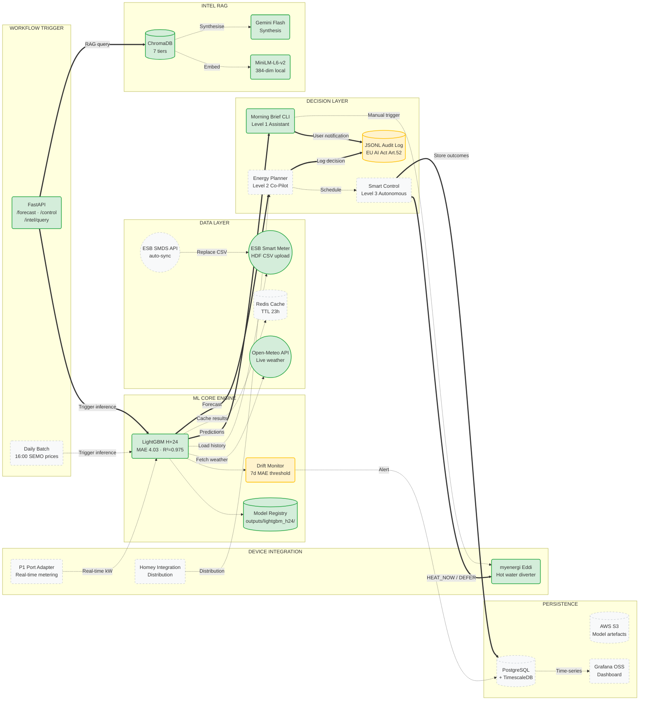

# Sparc Energy — Target Architecture (Current + Roadmap)

**Last updated:** 2026-04-20

> Legend: ✅ = in production | 🔧 = built, not deployed | 🗓 = roadmap

---

## System Architecture Diagram

---

## Component Status

| Component | Status | File / Endpoint | Notes |
|-----------|--------|----------------|-------|
| FastAPI API | ✅ Live | `deployment/app.py` | `/predict`, `/control`, `/health`, `/intel/query` |
| LightGBM H+24 | ✅ Live | `outputs/models/` | MAE 4.03 kWh, R²=0.975 |
| ModelRegistry | ✅ Built | `src/energy_forecast/registry/model_registry.py` | CANDIDATE/ACTIVE/RETIRED lifecycle + rollback; 20 tests |
| Open-Meteo integration | ✅ Live | `deployment/connectors.py` | Live weather fetch with retry |
| ESB CSV ingest | ✅ Live | `deployment/connectors.py` | Manual HDF upload, schema-validated |
| Morning Brief CLI | ✅ Live | `deployment/live_inference.py` | Level 1 assistant, dry-run safe |
| myenergi Eddi API | ✅ Live | `deployment/connectors.py` | Hub 21509692, status/schedule/history |
| ChromaDB RAG | ✅ Live | `intel/` | 7 tiers, MiniLM-L6-v2, 178 total repo tests |
| Gemini Flash synthesis | ✅ Live | `intel/retrieval.py` | Falls back to raw text |
| DriftDetector (KS+PSI) | ✅ Built | `src/energy_forecast/monitoring/drift_detector.py` | 23 tests; not running as a persistent service yet |
| JSONL audit log | ✅ Built | `outputs/logs/control_decisions.jsonl` | Append-only, EU AI Act Art. 52 |
| Dockerfile + App Runner | 🔧 Ready | `deployment/Dockerfile`, `apprunner.yaml` | Phase 7 — not yet deployed |
| TimescaleDB + PostgreSQL | 🔧 In compose | `docker-compose.yml`, `infra/db/init.sql` | Full schema exists; not running in production |
| Redis cache | 🔧 In compose | `docker-compose.yml` | Wired to FastAPI via REDIS_URL; not in production |
| Grafana OSS | 🔧 In compose | `infra/grafana/provisioning/` | Auto-provisioned datasource + dashboard; not in production |
| Caddy reverse proxy | 🔧 In compose | `infra/Caddyfile` | `api.sparc.localhost`, `grafana.sparc.localhost` |
| Daily 16:00 batch trigger | 🗓 Roadmap | — | APScheduler or Lambda (DAN-65) |
| Energy Planner (L2) | 🗓 Roadmap | — | DAN-22, DAN-38 — Sprint 3 |
| Smart Control Engine (L3) | 🗓 Roadmap | — | DAN-40 — Q3/Q4 2026 |
| P1 port adapter | 🗓 Roadmap | — | Hardware + ESB software unlock late 2026 |
| ESB SMDS auto-sync | 🗓 Roadmap | — | Pending SMDS launch mid-2026 |
| Homey integration | 🗓 Roadmap | — | Distribution channel Q3 2026 |
| AWS S3 model storage | 🗓 Roadmap | — | With App Runner deploy (Phase 7) |

> **Test suite (verified 2026-04-20):** 178 tests total — 12 integration, 20 registry, 23 drift, 19 validation, 54 connector, others. Run: `pytest tests/ -q`

---

## What the n8n / Intercom Framework Recommended vs. What We're Doing

| Recommendation | Our decision | Why |
|----------------|-------------|-----|
| n8n workflow automation | **Skip** — use Claude Code hooks instead | n8n adds operational overhead; git hooks achieve the same PR enforcement with zero infra |
| TimescaleDB for predictions | **Already in compose** — activate with DAN-65 Supabase | `infra/db/init.sql` has full schema; flip `docker compose up` when ready |
| Redis cache | **Already in compose** — activate when App Runner is live | TTL-based caching wired in; no new code needed |
| Grafana observability | **Already in compose** — activate post Phase 7 | `infra/grafana/provisioning/` ready; ship with Mac Mini (DAN-53) |
| Custom PR hook (MAE in PRs) | **Sprint 2** — `.claude/commands/sparc-pr.md` | Zero infra; same principle as n8n's custom skill |
| Agent-friendly CLI (JSON output) | **Sprint 2** — `--json` flag on inference scripts | One flag, high value for agentic automation |
| Auto-fix flaky tests via AI | **Skip** — too risky | 178 tests are stable; autonomously patching them can mask real regression bugs |

---

## Azure Dual-Stack (DAN-80 — Interview Showcase)

The same architecture runs in parallel on Azure for enterprise interview credibility:

| Component | Sparc (OSS) | Azure Portfolio (DAN-80) |
|-----------|------------|------------------------|
| Vector store | ChromaDB (local) | Azure AI Search |
| Embeddings | MiniLM-L6-v2 (free) | text-embedding-3-small (Azure OpenAI) |
| LLM synthesis | Gemini Flash | GPT-4o (Azure OpenAI) |
| RAG framework | LlamaIndex | LangChain |
| Hosting | AWS App Runner | Azure Container Apps |
| Secrets | AWS Secrets Manager | Azure Key Vault |

> Story: *"I maintain both stacks. Same architecture, two clouds. This proves I can take a system I built for commercial product use and instantly port it to a walled-garden enterprise Microsoft environment — the exact translation skill a large employer needs."*
