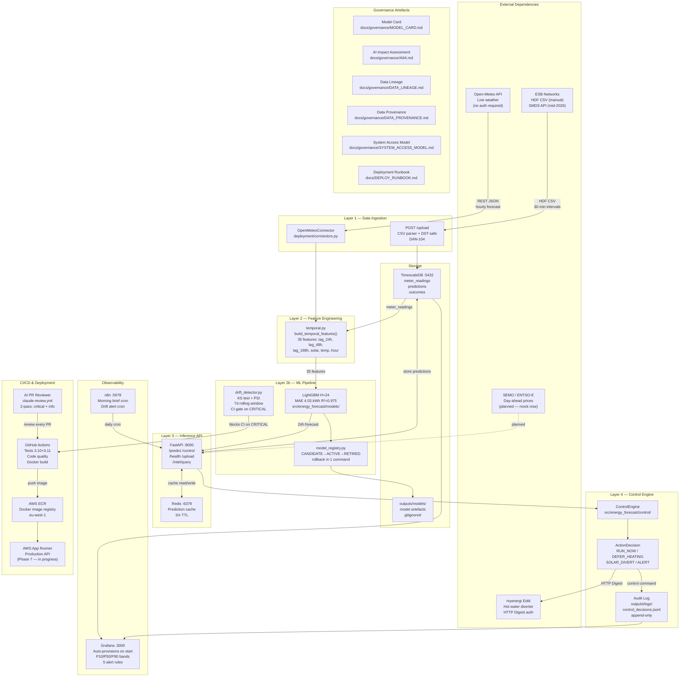

# System Component Map — Sparc Energy
*Created: 2026-03-28 | Last modified: 2026-03-28*
*Format: Operational footprint document — all modules, external dependencies, data flows, failure modes*
*Governance reference: companion to Data Lineage, AIIA, and Deployment Runbook*

---

## Purpose

This document maps every component the Sparc Energy system touches: internal services, external APIs, infrastructure, CI/CD, and governance artefacts. An ops engineer inheriting this system should be able to answer "what does this system connect to, what does each component do, and what breaks if X fails?" from this document alone.

---

## Architecture Overview (5-Layer Model)

```
┌─────────────────────────────────────────────────────────────────┐
│  LAYER 5 — PHYSICAL ACTION                                       │
│  myenergi Eddi hot water diverter (Maynooth, Co Kildare)        │
└──────────────────────────┬──────────────────────────────────────┘
                           │ HTTP Digest (myenergi API)
┌──────────────────────────▼──────────────────────────────────────┐
│  LAYER 4 — CONTROL ENGINE                                        │
│  ControlEngine → ActionDecision (RUN_NOW / DEFER / ALERT)       │
│  Audit Log: outputs/logs/control_decisions.jsonl (append-only)  │
└──────────────────────────┬──────────────────────────────────────┘
                           │
┌──────────────────────────▼──────────────────────────────────────┐
│  LAYER 3 — INFERENCE API                                         │
│  FastAPI :8000 — /predict /control /health /upload /intel/query │
│  Redis :6379 (prediction cache, 1hr TTL)                        │
└──────┬───────────────────┬───────────────────────────────────────┘
       │                   │
┌──────▼──────┐    ┌───────▼──────────────────────────────────────┐
│  LAYER 2    │    │  LAYER 3b — STORAGE                           │
│  ML PIPELINE│    │  TimescaleDB :5432 (meter_readings,           │
│  LightGBM   │    │  predictions, recommendations, outcomes)      │
│  H+24 model │    │  outputs/models/ (model artefacts, gitignored)│
│  35 features│    └──────────────────────────────────────────────┘
└──────┬──────┘
       │
┌──────▼──────────────────────────────────────────────────────────┐
│  LAYER 1 — DATA INGESTION                                        │
│  ESB Networks HDF CSV (manual upload → POST /upload)            │
│  Open-Meteo API (live weather, no auth)                         │
│  SEMO prices (planned — mock in current version)                │
└─────────────────────────────────────────────────────────────────┘
```

---

## Full Component Diagram (Mermaid)



---

## External Dependencies

| Dependency | Auth | Availability | What breaks if down | Mitigation |
|-----------|------|-------------|---------------------|------------|
| **Open-Meteo API** | None (public) | 99.9% SLA (public claim) | Forecast degrades — weather features set to last-known values | Cache last 48h of weather in TimescaleDB; alert fires |
| **myenergi API** (Eddi) | HTTP Digest (serial + API key) | Best-effort (home LAN + cloud relay) | No control commands sent; Eddi continues current schedule | Dry-run mode always available; schedule fallback is safe |
| **ESB Networks HDF CSV** | Manual download, no API auth | User-initiated | No new meter data; model runs on stale features | P1 port connector (Phase 2) will automate; manual path always available |
| **SEMO / ENTSO-E prices** | REST (planned) | — | Price signal unavailable; tariff-based fallback (BGE fixed rates) | Mock prices used in current version; BGE fixed rate in `tariff.py` |
| **AWS ECR / App Runner** | AWS IAM (Makefile) | 99.99% AWS SLA | Production API unavailable | Local Docker stack is fully functional alternative |
| **Anthropic API** | Bearer token | 99.9% (Anthropic) | AI PR reviewer fails; CI continues (not a required check) | Informational only; 4 Required CI checks unaffected |

---

## Internal Services

| Service | Port | Role | Data it owns | Restart behaviour |
|---------|------|------|-------------|-------------------|
| **FastAPI** | 8000 | Inference API, control gateway | Stateless — reads from TimescaleDB + Redis | Restarts cleanly; model loaded from `outputs/models/` on startup |
| **TimescaleDB** | 5432 | Persistent time-series storage | `meter_readings`, `predictions`, `recommendations`, `outcomes` | Data persists in Docker volume; safe restart |
| **Redis** | 6379 | Prediction cache | Ephemeral — predictions only (1hr TTL) | Cache miss on restart; FastAPI recomputes; no data loss |
| **Grafana** | 3000 | Operations dashboard | Dashboard definitions in `infra/grafana/provisioning/` | Auto-provisions on start; no manual setup needed |
| **n8n** | 5678 | Workflow automation | Workflow definitions in n8n volume | Cron triggers resume on restart |

---

## Data Flows (Summary)

```
ESB CSV (HDF) ──→ POST /upload ──→ TimescaleDB.meter_readings
                                         │
Open-Meteo ─────→ OpenMeteoConnector     │
                         │               │
                         └───→ temporal.py (35 features)
                                         │
                                    LightGBM H+24
                                         │
                               FastAPI /predict ──→ Redis cache
                                         │           │
                               TimescaleDB.predictions
                                         │
                               FastAPI /control
                                         │
                               ControlEngine
                                    │        │
                               JSONL log   myenergi Eddi
                               (audit)     (physical action)
                                         │
                                  Grafana dashboard
```

---

## Failure Mode Analysis

| Component | Failure type | Impact | Detection | Recovery |
|-----------|-------------|--------|-----------|----------|
| TimescaleDB down | Container crash | API returns 503; no predictions stored | `/health` endpoint returns unhealthy | `docker compose restart db`; data intact in volume |
| Redis down | Container crash | Predictions recomputed on every request; ~200ms latency increase | `/health` endpoint | `docker compose restart redis`; no data loss |
| LightGBM model missing | `outputs/models/` empty | API falls back to mock mode; `/health` shows `"model":"mock"` | `/health` check | Re-run `scripts/run_pipeline.py --city ireland --save-predictions` |
| Model drift | 7d MAE > 1.5× training threshold | `drift_detector.py` exits 1; CI blocks deployment | CI failure email | Investigate feature distribution shift; retrain with recent data |
| myenergi API unreachable | Network or auth failure | No control commands; Eddi continues last schedule | Log error in JSONL audit | Check `.env` credentials; verify hub serial and API key |
| Open-Meteo unavailable | API timeout | Weather features fall back to last-cached values | Connector exception logged | Auto-retry with 3× backoff; alert if >2h unavailable |
| AWS App Runner down | AWS incident | Production API unavailable | CloudWatch alarm | Local Docker stack as fallback; repoint DNS |
| GitHub Actions failure | CI red | No new deployments; `main` protected | Email notification | Investigate failing check; fix before merging |

---

## Governance Artefact Map

| Artefact | File | What it covers |
|---------|------|---------------|
| Model Card | `docs/governance/MODEL_CARD.md` | Model identity, accuracy, limitations, bias, publication |
| AI Impact Assessment | `docs/governance/AIIA.md` | Affected parties, EU AI Act classification, mitigations |
| Data Lineage | `docs/governance/DATA_LINEAGE.md` | 8-stage pipeline map, quality gates, bug impact |
| Data Provenance | `docs/governance/DATA_PROVENANCE.md` | 5 data sources, consent chains, GDPR basis |
| System Component Map | `docs/governance/SYSTEM_COMPONENT_MAP.md` (this file) | All modules, external deps, failure modes |
| System Access Model | `docs/governance/SYSTEM_ACCESS_MODEL.md` | All credentials, ownership, rotation policy |
| Deployment Runbook | `docs/DEPLOY_RUNBOOK.md` | Go-live procedure, incident response, rollback |
| Audit Log | `outputs/logs/control_decisions.jsonl` | Every automated decision, append-only |

---

*Owner: Dan Alexandru Bujoreanu | Review cycle: on each Phase boundary*
